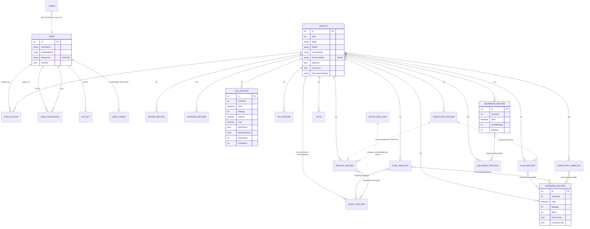

# 03 – Domain- und Datenmodell (Ist-Zustand)

Quellenbezug: `hargata/lubelog` @ `dd69e59` (v1.7.3). Statusmarker siehe `01-repository-ueberblick.md`.

## 1. Grundsätze des Modells

| # | Aussage | Quelle | Status |
|---|---|---|---|
| M-1 | **ID-Strategie:** Alle Fachentitäten haben `int Id`, vergeben von der Datenbank (LiteDB-Autoincrement bzw. PostgreSQL `GENERATED BY DEFAULT AS IDENTITY`). `Id = 0` bedeutet „neu“ und löst ein Insert aus; `Id ≠ 0` ein Update/Upsert. IDs sind global je Tabelle, nicht je Fahrzeug, und erratbar (fortlaufend). | `External/Implementations/*/*DataAccess.cs` (`Save…`), z. B. `Postgres/GasRecordDataAccess.cs:96-133` | [VERIFIZIERT] |
| M-2 | **Kein relationales Modell:** Beziehungen sind reine Integer-Referenzen ohne Fremdschlüssel; Listen (Dateien, Tags, Zusatzfelder, Verbrauchshistorie) sind eingebettet. | `Models/**`, PG-`initCMD` | [VERIFIZIERT] |
| M-3 | **Nullbarkeit:** Nahezu alle Felder sind nicht-nullbare Werttypen oder Strings mit Default `""`/leere Liste. „Nicht gesetzt“ wird über den Default-Wert (0, `""`, `DateTime.MinValue`) ausgedrückt, z. B. `Mileage = 0` = „kein Kilometerstand“. | Modelle; `GasHelper.cs:98,193` (`Mileage != default`) | [VERIFIZIERT] |
| M-4 | **Einheiten werden nicht pro Wert gespeichert.** Kilometerstand, Menge und Kosten sind dimensionslose Zahlen; ihre Einheit ergibt sich zur Anzeigezeit aus Benutzereinstellungen (`UseMPG`, `UseUKMPG`) bzw. Fahrzeugeigenschaften (`IsElectric`, `UseHours`). Zwei Nutzer mit unterschiedlichen Einstellungen interpretieren denselben Datensatz unterschiedlich. | `Views/Vehicle/Gas/_Gas.cshtml:24-45`, `StaticHelper.GetFuelEconomyUnit` (`StaticHelper.cs:294-315`), `Models/Settings/UserConfig.cs` | [VERIFIZIERT] (Code); Folgerung für geteilte Fahrzeuge [ABGELEITET] |
| M-5 | **Währung wird nicht gespeichert.** Kosten sind `decimal`; das Währungssymbol kommt aus der Server-Kultur (`ToString("C")`). | `StaticHelper.HideZeroCost` (`StaticHelper.cs:763-784`), `/api/info` | [VERIFIZIERT] |
| M-6 | **Datum:** Fachliche Datumswerte sind `DateTime` ohne Zeitzone, in der Regel Mitternacht (reines Datum aus Datepicker/`DateTime.Parse`). LiteDB speichert `DateTime` als UTC-Zeitpunkt und rechnet beim Lesen in die **aktuelle** Server-Zeitzone zurück. Wechselt die Server-Zeitzone, verschieben sich alle Datumswerte (z. B. UTC → Pacific/Honolulu: `2026-01-01` wird als `2025-12-31` gelesen). | `Models/**` (`DateTime Date`); ausgeführt: gleicher `data/`-Ordner mit `TZ=UTC` vs. `TZ=Pacific/Honolulu` | [VERIFIZIERT] (ausgeführt) |
| M-7 | PostgreSQL speichert `DateTime` innerhalb des JSONB über `System.Text.Json` als ISO-String ohne Offset (`"2026-01-01T00:00:00"`); damit zeitzonenstabil, aber ohne Zeitzoneninformation. | `Postgres/*DataAccess.cs` (`JsonSerializer.Serialize`) | [ABGELEITET] (Standardverhalten von `System.Text.Json` für `DateTimeKind.Unspecified`; nicht ausgeführt) |
| M-8 | **Datumswerte als String:** `Vehicle.PurchaseDate`, `Vehicle.SoldDate` sind Strings im Format der UI-Kultur; `PlanRecordTemplate.DateCreated/DateModified` und Formulareingaben werden mit `DateTime.Parse` (kulturabhängig) gelesen. | `Models/Vehicle/Vehicle.cs`, `Models/PlanRecord/PlanRecordInput.cs`, `ReportController.cs:584` | [VERIFIZIERT] |
| M-9 | **Keine Audit-/Versionsfelder:** Es gibt weder `createdAt/updatedAt` (Ausnahme `PlanRecord.DateCreated/DateModified`) noch Ersteller, Version oder Soft-Delete. Updates überschreiben, Deletes löschen hart. | alle Modelle, `Delete…ById` | [VERIFIZIERT] |
| M-10 | Persistiert werden teils **Input-Modelle**: Planvorlagen als `PlanRecordInput`, Inspektionsvorlagen als `InspectionRecordInput`. | `IPlanRecordTemplateDataAccess`, `IInspectionRecordTemplateDataAccess`, `MigrationController.cs:285,461` | [VERIFIZIERT] |

## 2. Entitäten

Legende Spalte „Einheit/Semantik“: *Distanz* = Meilen, Kilometer oder Motorstunden je nach `UseMPG`/`Vehicle.UseHours`; *Menge* = US-Gallonen, Liter oder kWh je nach Einstellungen (Details BR-059); *Geld* = Serverwährung.

### 2.1 Vehicle (`vehicles`) – `Models/Vehicle/Vehicle.cs` [VERIFIZIERT]

| Feld | Typ | Default | Einheit/Semantik | Anmerkung |
|---|---|---|---|---|
| Id | int | DB | – | |
| ImageLocation | string | `/defaults/noimage.png` | Pfad `/images/{guid}.{ext}` oder Default | |
| MapLocation | string | `""` | Pfad zu JSON-Imagemap in `/documents/` | F-024 |
| Year | int | 0 | Baujahr | UI-Hinweis „must be after 1900“, serverseitig nicht geprüft [VERIFIZIERT: `_VehicleModal.cshtml:32`, keine Prüfung in `SaveVehicle`] |
| Make, Model, LicensePlate | string | `""` | Hersteller, Modell, Kennzeichen | keine VIN/FIN-Felder; VIN nur als Extra-Field möglich |
| PurchaseDate, SoldDate | string | `""` | Datum als kulturabhängiger String | API liefert bei `culture-invariant` `yyyy-MM-dd` (`FromDateOptional`) |
| PurchasePrice, SoldPrice | decimal | 0 | Geld | Abschreibung BR-040 |
| IsElectric, IsDiesel | bool | false | Kraftstoffart (Benzin = beide false) | Beide gleichzeitig true möglich (API-Update setzt nie zurück, D-19) |
| UseHours | bool | false | Kilometerstand = Motorstunden | |
| OdometerOptional | bool | false | Kilometerstand bei Einträgen optional (0 erlaubt) | |
| ExtraFields | List<ExtraField> | [] | benutzerdefinierte Felder | |
| Tags | List<string> | [] | | |
| HasOdometerAdjustment | bool | false | Tachokorrektur aktiv | BR-022 |
| OdometerMultiplier | **string** | `"1"` | Faktor | als String gespeichert, kulturabhängig geparst |
| OdometerDifference | **string** | `"0"` | Offset (int) | |
| DashboardMetrics | List<DashboardMetric> | [] | Garage-Kacheln (`Default`, `TotalCost`, `CostPerMile`) | |
| VehicleIdentifier | string | `"LicensePlate"` | Name des Feldes, das als Kennung angezeigt wird (Kennzeichen oder Name eines Extra-Fields) | BR-050 |

### 2.2 Generische Wartungseinträge: ServiceRecord (`servicerecords`), CollisionRecord = Repair (`collisionrecords`), UpgradeRecord (`upgraderecords`) – `Models/Shared/GenericRecord.cs` [VERIFIZIERT]

Alle drei erben ohne Erweiterung von `GenericRecord`; sie unterscheiden sich nur durch die Tabelle.

| Feld | Typ | Default | Einheit/Semantik |
|---|---|---|---|
| Id, VehicleId | int | – | |
| Date | DateTime | – | Datum (Mitternacht) |
| Mileage | int | 0 | Distanz (Kilometerstand) |
| Description | string | `""` | Freitext |
| Cost | decimal | 0 | Geld, **eine** Gesamtsumme (keine Trennung Teile/Arbeit) |
| Notes | string | `""` | optional Markdown (`UseMarkDownOnSavedNotes`) |
| Files | List<UploadedFiles> | [] | Anhänge |
| Tags | List<string> | [] | |
| ExtraFields | List<ExtraField> | [] | |
| RequisitionHistory | List<SupplyUsageHistory> | [] | verbrauchte Lagerteile |

Nicht vorhanden: Werkstatt, Kategorie, Teileliste (außer über Supplies), Verknüpfung zu Reminder (nur einmaliger Pushback beim Speichern, BR-033). [VERIFIZIERT]

### 2.3 GasRecord (`gasrecords`) – `Models/GasRecord/GasRecord.cs` [VERIFIZIERT]

| Feld | Typ | Default | Einheit/Semantik |
|---|---|---|---|
| Id, VehicleId | int | – | |
| Date | DateTime | – | Datum, keine Uhrzeit |
| Mileage | int | 0 | Distanz; 0 = nicht erfasst |
| Gallons | decimal | 0 | Menge: US gal (`UseMPG`), l (metrisch **und** bei `UseUKMPG`), kWh bei EV |
| Cost | decimal | 0 | Geld, Gesamtbetrag der Betankung |
| IsFillToFull | bool | **true** | Vollbetankung |
| MissedFuelUp | bool | false | vorherige Betankung nicht erfasst |
| StartingSoc, EndingSoc | int | 20 / 80 | Ladezustand in % (nur EV relevant) |
| Notes, Files, Tags, ExtraFields, RequisitionHistory | | | wie oben |

Abgeleitete Werte (nicht gespeichert, `GasRecordViewModel`): `DeltaMileage`, `MilesPerGallon` (Verbrauch in Anzeigeeinheit), `CostPerGallon`, `IncludeInAverage`, `MonthId`. [VERIFIZIERT: `Models/GasRecord/GasRecordViewModel.cs`]

### 2.4 OdometerRecord (`odometerrecords`) – `Models/OdometerRecord/OdometerRecord.cs` [VERIFIZIERT]

| Feld | Typ | Default | Einheit/Semantik |
|---|---|---|---|
| Id, VehicleId | int | – | |
| Date | DateTime | – | Datum, keine Uhrzeit |
| InitialMileage | int | 0 | Distanz: Stand am Beginn des Abschnitts (vorheriger Eintrag) |
| Mileage | int | 0 | Distanz: abgelesener Stand |
| DistanceTraveled | int (berechnet) | – | `Mileage − InitialMileage`, kann negativ sein |
| Notes, Tags, Files, ExtraFields | | | |
| EquipmentRecordId | List<int> | [] | während dieses Abschnitts montierte Ausstattung |

Nicht vorhanden: Herkunft des Werts (manuell/automatisch – nur indirekt über Notiztext „Auto Insert From …“ und Pseudo-Anhang `::ImportMode:id`), Uhrzeit, Korrekturvermerk. [VERIFIZIERT: `StaticHelper.GetAutoInsertVerbiage`, `CreateAttachmentFromRecord`]

### 2.5 TaxRecord (`taxrecords`) – `Models/TaxRecord/TaxRecord.cs` [VERIFIZIERT]

| Feld | Typ | Default | Semantik |
|---|---|---|---|
| Id, VehicleId, Date, Description, Cost, Notes, Files, Tags, ExtraFields | | | wie GenericRecord, **ohne Mileage** |
| IsRecurring | bool | false | wiederkehrende Gebühr |
| RecurringInterval | ReminderMonthInterval | `OneYear` (Input-Default: `ThreeMonths`) | 1/3/6/12/24/36/60 Monate oder `Other` |
| CustomMonthInterval | int | 0 | bei `Other` |
| CustomMonthIntervalUnit | ReminderIntervalUnit | `Months` | `Months` oder `Days` |

### 2.6 ReminderRecord (`reminderrecords`) – `Models/Reminder/ReminderRecord.cs` [VERIFIZIERT]

| Feld | Typ | Default | Semantik |
|---|---|---|---|
| Id, VehicleId | int | – | |
| Date | DateTime | (Input: morgen) | Fälligkeitsdatum |
| Mileage | int | 0 | Fälligkeits-Kilometerstand (Distanz) |
| Description, Notes, Tags | | | |
| Metric | ReminderMetric | `Date` | `Date`, `Odometer`, `Both` |
| IsRecurring | bool | false | |
| FixedIntervals | bool | false | Fortschreibung vom alten Fälligkeitswert statt vom Erledigungswert |
| ReminderMileageInterval | Enum | `FiveThousandMiles` | 50 … 150 000 oder `Other` |
| CustomMileageInterval | int | 0 | bei `Other` |
| ReminderMonthInterval | Enum | `OneYear` | 1 … 60 Monate oder `Other` |
| CustomMonthInterval / CustomMonthIntervalUnit | int / Enum | 0 / `Months` | |
| UseCustomThresholds | bool | false | eigene Dringlichkeitsschwellen |
| CustomThresholds | ReminderUrgencyConfig | 30/7 Tage, 100/50 Distanz | `UrgentDays`, `VeryUrgentDays`, `UrgentDistance`, `VeryUrgentDistance` |

Abgeleitet (`ReminderRecordViewModel`): `Urgency` (`NotUrgent`, `Urgent`, `VeryUrgent`, `PastDue`), `DueDays`, `DueMileage`, `Metric` (auslösende Metrik bei `Both`), `UserMetric`. Die Enum-Namen `…Miles` sind rein numerisch; die Einheit folgt der Benutzereinstellung. [VERIFIZIERT: `Enum/ReminderMileageInterval.cs`, `ReminderHelper.cs:38-55`]

### 2.7 Note (`notes`) – `Models/Note/Note.cs` [VERIFIZIERT]
Felder: `Id`, `VehicleId`, `Description`, `NoteText`, `Pinned` (bool), `Tags`, `Files`, `ExtraFields`. Kein Datum.

### 2.8 SupplyRecord (`supplyrecords`) – `Models/Supply/SupplyRecord.cs` [VERIFIZIERT]

| Feld | Typ | Semantik |
|---|---|---|
| Id | int | |
| VehicleId | int | **0 = Werkstattlager („Shop Supplies“), fahrzeugübergreifend** |
| Date | DateTime | Kaufdatum |
| PartNumber, PartSupplier, Description, Notes | string | |
| Quantity | decimal | aktueller Bestand (einheitenlos), wird bei Verbrauch reduziert, kann negativ werden |
| Cost | decimal | aktueller Restwert (wird anteilig reduziert) |
| Files, Tags, ExtraFields | | |
| RequisitionHistory | List<SupplyUsageHistory> | Verbrauchs-/Rückbuchungs-Historie |

`SupplyUsageHistory` (eingebettet): `Id` (= Supply-ID bzw. in Records die Quell-Supply-ID), `Date`, `PartNumber`, `Description`, `Quantity`, `Cost`. [VERIFIZIERT: `Models/Supply/SupplyUsageHistory.cs`]

### 2.9 PlanRecord (`planrecords`) und PlanRecordTemplate (`planrecordtemplates`) [VERIFIZIERT]

| Feld | Typ | Semantik |
|---|---|---|
| Id, VehicleId | int | |
| ReminderRecordId | int | Legacy-Einzelverknüpfung zu Reminder |
| ReminderRecordIds | List<int> | verknüpfte Reminder |
| DateCreated, DateModified | DateTime (Vorlage: string) | mit Uhrzeit (`DateTime.Now`) |
| Description, Notes, Files, ExtraFields | | |
| ImportMode | ImportMode | Ziel-Typ bei Erledigung: Service, Repair, Upgrade |
| Priority | PlanPriority | `Critical`, `Normal`, `Low` |
| Progress | PlanProgress | `Backlog`, `InProgress`, `Testing`, `Done` |
| Cost | decimal | Geld |
| RequisitionHistory | List<SupplyUsageHistory> | |
| *(nur Vorlage)* Supplies | List<SupplyUsage> | geplante Teile (`SupplyId`, `Quantity`) |
| *(nur Vorlage)* CopySuppliesAttachment | bool | |

Quellen: `Models/PlanRecord/PlanRecord.cs`, `Models/PlanRecord/PlanRecordInput.cs`.

### 2.10 InspectionRecord (`inspectionrecords`) und InspectionRecordTemplate (`inspectionrecordtemplates`) [VERIFIZIERT]

InspectionRecord: `Id`, `VehicleId`, `Date`, `Mileage`, `Cost`, `Description`, `Files`, `Tags`, `Results: List<InspectionRecordResult>`, berechnet `Failed` (= irgendein Ergebnis fehlgeschlagen).
InspectionRecordResult: `Description`, `Values: List<{Description, IsSelected, IsFail}>`, `Failed`, `Notes`, `FieldType` (`Text`, `Check`, `Radio`).
Vorlage (`InspectionRecordInput`): zusätzlich `ReminderRecordId: List<int>`, `Fields: List<InspectionRecordTemplateField>` mit `Options`, `ActionItemType` (ImportMode), `ActionItemDescription`, `ActionItemPriority`, `HasNotes`, `HasActionItem`.
Quellen: `Models/InspectionRecord/*.cs`.

### 2.11 EquipmentRecord (`equipmentrecords`) – `Models/EquipmentRecord/EquipmentRecord.cs` [VERIFIZIERT]
Felder: `Id`, `VehicleId`, `Description`, `IsEquipped` (aktuell montiert), `Notes`, `Tags`, `Files`, `ExtraFields`. Abgeleitet: `DistanceTraveled` = Summe der Distanzen verknüpfter Odometer-Einträge (BR-024). Typischer Anwendungsfall: Reifensätze, Anhänger. [ABGELEITET aus Feldnamen und UI-Texten]

### 2.12 Benutzer und Rechte [VERIFIZIERT]

| Entität (Tabelle) | Felder | Quelle |
|---|---|---|
| UserData (`userrecords`) | `Id`, `UserName`, `EmailAddress`, `Password` (SHA-256-Hex, ungesalzen; `""` = OIDC-Nutzer), `IsAdmin`, `IsRootUser` (nur zur Laufzeit, Root = Id −1) | `Models/User/UserData.cs`, `Postgres/UserRecordDataAccess.cs` |
| Token (`tokenrecords`) | `Id`, `Body` (8 Hex-Zeichen, Klartext), `EmailAddress` | `Models/Login/Token.cs`, `LoginLogic.NewToken` |
| UserAccess (`useraccessrecords`) | Composite-ID `{UserId, VehicleId}` – Kollaborator-Zuordnung | `Models/User/UserAccess.cs` |
| UserHousehold (`userhouseholdrecords`) | Composite-ID `{ParentUserId, ChildUserId}`, `Permissions: List<HouseholdPermission>` (`View`, `Edit`, `Delete`) | `Models/User/UserHousehold.cs` |
| APIKey (`apikeyrecords`) | `Id`, `UserId` (−1 = Root), `Name`, `Key` (SHA-256 des Schlüssels), `Permissions` | `Models/API/APIKey.cs`, `UserLogic.CreateAPIKey` |
| UserConfigData (`userconfigrecords`) | `Id` = UserId, `UserConfig` (≈ 40 Einstellungen) | `Models/User/UserConfigData.cs`, `Models/Settings/UserConfig.cs` |

### 2.13 Zusatzfelder (`extrafields`) [VERIFIZIERT]
`RecordExtraField`: `Id` = `ImportMode` des Record-Typs, `ExtraFields: List<ExtraField>` als Vorlage. `ExtraField` (auch eingebettet in Records): `Name`, `Value` (immer String), `IsRequired`, `FieldType` (`Text`, `Number`, `Decimal`, `Date`, `Time`, `Location`). Vorlage und Record-Werte werden per Namen zusammengeführt (BR-049). Quellen: `Models/Shared/RecordExtraField.cs`, `Models/Shared/ExtraField.cs`, `Enum/ExtraFieldType.cs`.

### 2.14 Eingebettete Wertobjekte [VERIFIZIERT]
- `UploadedFiles`: `Name` (Anzeigename), `Location` (`/documents/{guid}.{ext}`, externe URL oder Record-Link `::ImportMode:id`), `IsPending` (nur UI). `Models/Shared/UploadedFiles.cs`
- `SupplyUsage`: `SupplyId`, `Quantity`. `Models/Supply/SupplyUsage.cs`

### 2.15 Konfiguration als Datei (nicht in der DB) [VERIFIZIERT]
- `data/config/userConfig.json`: `UserConfig` des Root-Users = Server-Defaults für alle Nutzer ohne eigene Einstellungen, inklusive `EnableAuth`, `UserNameHash`, `UserPasswordHash`. `ConfigHelper.GetUserConfig` (`ConfigHelper.cs:458-534`).
- `data/config/serverConfig.json`: `ServerConfig` (SMTP, OIDC, Webhook, Notification, Kestrel …). `Models/Settings/ServerConfig.cs`.

## 3. Aufzählungen mit fachlicher Bedeutung [VERIFIZIERT]

| Enum | Werte | Quelle |
|---|---|---|
| ImportMode (= Record-Typ, Tab-ID) | 0 Service, 1 Repair, 2 Gas, 3 Tax, 4 Upgrade, 5 Reminder, 6 Note, 7 Supply, 8 Dashboard, 9 Plan, 10 Odometer, 11 Vehicle, 12 Inspection, 13 Equipment | `Enum/ImportMode.cs` |
| ReminderMetric | 0 Date, 1 Odometer, 2 Both | `Enum/ReminderMetric.cs` |
| ReminderUrgency | 0 NotUrgent, 1 Urgent, 2 VeryUrgent, 3 PastDue | `Enum/ReminderUrgency.cs` |
| HouseholdPermission | 0 View, 1 Edit, 2 Delete | `Enum/HouseholdPermission.cs` |
| PlanPriority / PlanProgress | Critical, Normal, Low / Backlog, InProgress, Testing, Done | `Enum/PlanPriority.cs`, `Enum/PlanProgress.cs` |
| DashboardMetric | Default, TotalCost, CostPerMile | `Enum/DashboardMetric.cs` |
| AutomatedEvent | AllReminder, ReminderStateChanged, BackupEmail, UpdateRecurringTax, CleanTempFile, DeepClean | `Enum/AutomatedEvent.cs` |

**Hinweis:** Enums werden als Integer gespeichert (LiteDB/`System.Text.Json`-Default). Eine Änderung der Reihenfolge würde Bestandsdaten umdeuten. [ABGELEITET: Standardserialisierung, kein `JsonStringEnumConverter` registriert]

## 4. Record-Typen – Übersicht

| Record-Typ | Tabelle | Datum | Km-Stand | Kosten | Wiederkehrend | Supplies | Reminder-Link | Anhänge |
|---|---|---|---|---|---|---|---|---|
| Service | servicerecords | ✓ | ✓ | ✓ | – | ✓ | Pushback | ✓ |
| Repair | collisionrecords | ✓ | ✓ | ✓ | – | ✓ | Pushback | ✓ |
| Upgrade | upgraderecords | ✓ | ✓ | ✓ | – | ✓ | Pushback | ✓ |
| Fuel (Gas) | gasrecords | ✓ | ✓ | ✓ | – | ✓ | – | ✓ |
| Tax/Fees | taxrecords | ✓ | – | ✓ | ✓ (Auto-Generierung) | – | Pushback (Datum) | ✓ |
| Odometer | odometerrecords | ✓ | ✓ (+Initial) | – | – | – | – | ✓ |
| Reminder | reminderrecords | Fälligkeit | Fälligkeit | – | ✓ | – | – | – |
| Note | notes | – | – | – | – | – | – | ✓ |
| Supply | supplyrecords | ✓ | – | ✓ (Restwert) | – | Bestand | – | ✓ |
| Plan | planrecords | Created/Modified | (bei Done) | ✓ | – | ✓ | ✓ (Liste) | ✓ |
| Plan-Vorlage | planrecordtemplates | – | – | ✓ | – | ✓ (geplant) | ✓ | ✓ |
| Inspection | inspectionrecords | ✓ | ✓ | ✓ | – | – | Pushback | ✓ |
| Inspection-Vorlage | inspectionrecordtemplates | – | – | ✓ | – | – | ✓ | ✓ |
| Equipment | equipmentrecords | – | via Odometer | – | – | – | – | ✓ |

Quelle: Modelle wie oben; Pushback-Logik `ServiceController.cs:49-55`, `TaxController.cs:51-57`, `InspectionController.cs:187-193`, `PlanController.cs:361-371`. [VERIFIZIERT]

Es gibt **keinen** eigenen Record-Typ für Öl-Nachfüllungen, Fahrten/Fahrtenbuch, Kilometerstand-Fotos oder Dokumente ohne Record-Bezug (Dokumente existieren nur als Anhänge). [VERIFIZIERT: `Enum/ImportMode.cs` vollständig]

## 5. ER-Diagramm (Ist-Zustand, logisch)

Anhänge (`UploadedFiles`), Tags, Extra-Field-Werte und `RequisitionHistory` sind in allen Records eingebettet und im Diagramm nicht separat dargestellt. Record-Links als Anhang (`::ImportMode:id`) sind weiche Referenzen auf beliebige Records. [VERIFIZIERT: `StaticHelper.GetAttachmentIsRecord` (`StaticHelper.cs:808-828`)]

## 6. Referentielle Integrität (Ist)

| Aussage | Quelle | Status |
|---|---|---|
| Löschen eines Fahrzeugs löscht alle abhängigen Records und Zugriffsrechte, **nicht** aber die Dateien (erst ein „Deep Clean“ entfernt unreferenzierte Dateien) | `VehicleLogic.DeleteVehicleRecords` (`VehicleLogic.cs:622-640`), `VehicleController.DeleteVehicle` | [VERIFIZIERT] |
| Löschen eines Nutzers entfernt Zugriffe, Einstellungen, Haushalte, API-Keys, **nicht** seine Fahrzeuge (ggf. verwaiste Fahrzeuge, die nur Root sieht) | `AdminController.DeleteUser` (`AdminController.cs:73-82`) | [VERIFIZIERT] |
| Gelöschte Reminder/Supplies bleiben in Plan-Vorlagen/Records referenziert; Konsistenz wird erst bei Nutzung geprüft („Missing … Please Delete This Template“) | `PlanController.cs:129-165` | [VERIFIZIERT] |
| Löschen eines Records mit Supply-Verbrauch bucht Menge/Kosten zurück ins Lager | `VehicleLogic.RestoreSupplyRecordsByUsage`, `ServiceController.cs:115-118` | [VERIFIZIERT] |
