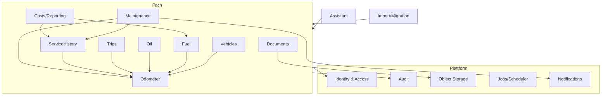

# 11 – Vorschlag für Phase 2 (Architektur- und Fachkonzept)

Dieses Dokument ist ein **Vorschlag**; alle Aussagen sind [ABGELEITET] aus den Befunden der Phase 1 und den Vorgaben des Auftrags (Abschnitte 4–6). Phase 2 beginnt erst nach Freigabe.

## 1. Ziel und Ergebnisse von Phase 2

Ergebnis von Phase 2 sind **Entscheidungen und Spezifikationen, noch kein Produktivcode**:
1. ADRs (Abschnitt 2) mit Status „akzeptiert“.
2. Fachliches Domänenmodell der Zielmodule inkl. Invarianten (Kilometer-Monotonie, Öl-Messreihe, Fahrtenüberlappung, Wartungsfälligkeit).
3. Regelkatalog „Soll“: jede BR aus `04-geschaeftsregeln.md` mit Entscheidung KEEP/FIX/DROP und Soll-Formel; neue Regeln für Öl, Fahrten, Wartungsdefinitionen.
4. Entwurf OpenAPI 3.1 (nur Spezifikation, Konventionen + Kernressourcen).
5. Migrationskonzept (Mapping-Tabellen Quelle → Ziel, Prüfbericht, Parameter).
6. Nicht-funktionale Budgets bestätigt und messbar formuliert.
7. Spikes (zeitlich begrenzt, Wegwerfcode): Ressourcenbudget Go-Backend, LiteDB-Leser in Go, sqlc/pgx/River-Zusammenspiel.

## 2. Geplante ADRs

| ADR | Thema | Optionen | Vorläufige Tendenz | Bezug |
|---|---|---|---|---|
| ADR-001 | Architekturstil | modularer Monolith · Microservices | modularer Monolith (Vorgabe) | Auftrag 4 |
| ADR-002 | Modulgrenzen und Abhängigkeitsregeln | fachliche Module mit öffentlichen Service-Interfaces · Schichten global | fachliche Module, Zyklenverbot per Lint | Abschnitt 3 |
| ADR-003 | HTTP-Framework | chi · Echo · Gin · net/http pur | chi (Vorgabe) | 5.2 |
| ADR-004 | Datenzugriff | pgx+sqlc · GORM · ent | pgx+sqlc (Vorgabe) | 5.2, T-03 |
| ADR-005 | Migrationswerkzeug | goose · golang-migrate | goose (SQL-Dateien, Go-Hooks für Datenmigrationen) | 5.2 |
| ADR-006 | ID-Strategie | UUIDv7 client-generiert · Serial | UUIDv7 (Offline, Idempotenz) | 6.16, M-1 |
| ADR-007 | **Einheitenmodell** | SI kanonisch · pro Fahrzeug · pro Wert | SI kanonisch + Originalwert/-einheit | Q-01, BR-059 |
| ADR-008 | **Zeitmodell** | `timestamptz` · `date` | `timestamptz` + „Uhrzeit unbekannt“ | Q-02, D-03 |
| ADR-009 | **Kilometerstand-Modell** | eigene Odometer-Zeitreihe mit Herkunft · Maximum über Records (Ist) | eigene Zeitreihe, alle Records referenzieren Messpunkte; Tachotausch als Ereignis | Q-03, BR-015/021/022 |
| ADR-010 | Plausibilitätsregeln | ablehnen · warnen+bestätigen | warnen + bestätigen mit Audit | Q-03 |
| ADR-011 | Audit & Änderungsverfolgung | Audit-Tabelle · Event Sourcing | Audit-Tabelle (append-only), Korrekturen statt Überschreiben bei Messwerten | 6.4, 6.7, D-15 |
| ADR-012 | Optimistisches Locking & Idempotenz | ETag/If-Match + Idempotency-Key · last-write-wins | ETag/If-Match, Idempotency-Key für POST | 6.16, 6.17 |
| ADR-013 | API-Konventionen | RFC 9457, Cursor-Paginierung, Filtersyntax | RFC 9457, Cursor-Paginierung | 6.17, T-09/T-10 |
| ADR-014 | OpenAPI-Workflow | spec-first mit oapi-codegen · code-first | spec-first (Vorgabe), Clients TS/Kotlin generiert | 5.2 |
| ADR-015 | Authentifizierung | OIDC · lokal · beides; Sessions vs. Tokens | OIDC + lokal (Argon2id); Web: Server-Session-Cookie (HttpOnly, Secure, SameSite); Android: OAuth2 PKCE + kurzlebige Access-/Refresh-Tokens | Q-15, R-07/R-08/R-10 |
| ADR-016 | Autorisierung | Rollen je Fahrzeug (Eigentümer/Bearbeiter/Leser) + System-Admin; zentrale Policy-Schicht | zentrale Prüfung in Application Services, deny-by-default, Prüfung am geladenen Objekt | Q-04, R-01–R-06 |
| ADR-017 | Object Storage & Dateizugriff | lokales FS + S3-kompatibel; Auslieferung per Backend vs. signierte URLs | Abstraktion; Auslieferung über Backend-Endpunkt nach Rechteprüfung, optional kurzlebig signierte URLs; `attachment` + `nosniff` | R-03/R-04, 6.7, 6.11 |
| ADR-018 | Beweisfotos | Original + SHA-256 + Server-Zeit, EXIF separat, Ableitungen getrennt | wie Auftrag 6.7 | 07 §8 |
| ADR-019 | Background Jobs | River · eigener Scheduler | River (Vorgabe); Deduplizierung persistent | 5.2, D-17 |
| ADR-020 | Benachrichtigungen | E-Mail, UnifiedPush, FCM, Webhook | E-Mail + UnifiedPush Pflicht, FCM optional, Webhooks signiert | Q-14, F-049/F-051 |
| ADR-021 | Offline-Sync Android | Outbox + Idempotenz + ETag-Konflikte · CRDT | Outbox/WorkManager, UUIDv7, Konfliktdialog | 6.16 |
| ADR-022 | Web-Design-System | shadcn/ui · Mantine | per Prototyp beider Varianten entscheiden (Bundle-Budget 300 KB) | 5.2, 5.3 |
| ADR-023 | Diagramm-Bibliothek | Recharts · ECharts · Chart.js | kleinste, die Budgets hält | 5.2 |
| ADR-024 | KI-Anbieterabstraktion & Datenschutz | Ollama lokal · Cloud; Opt-in, Kennzeichnung externer Übertragung | Provider-Interface, standardmäßig aus | 6.12, 6.13 |
| ADR-025 | RAG-Pipeline & pgvector | Chunking-Strategie, Embedding-Dimension, Quellenzitate | pgvector, Seiten-/Stellenreferenz Pflicht | 6.12 |
| ADR-026 | Assistent als Werkzeugschicht | Tools über Application Services, Vorschlag → Bestätigung → Ausführung | wie Auftrag, Herkunft „Assistent“ im Audit | 6.13 |
| ADR-027 | Import/Migration aus LubeLogger | Offline-Import LiteDB · Direktzugriff PG · API | Offline-Import LiteDB + `data/`, Prüfbericht, idempotent | Q-06, 08 §7 |
| ADR-028 | Mehrsprachigkeit | i18n-Framework Web/Android, Serverseitige Texte (Mails) | ICU-MessageFormat, DE/EN | 5.3 |
| ADR-029 | Währung/Kosten | Währung je Betrag · je Installation; Teile/Arbeit getrennt | ISO-4217 je Betrag, Teile/Arbeit/Sonstiges | Q-09 |
| ADR-030 | Deployment & Betrieb | Compose + Caddy; Backups (pg_dump + Storage) | Vorgabe; Backup-Konzept inkl. Objekt-Storage | 5.2, D-16 |
| ADR-031 | Umgang mit Ist-Fehlern | exakt nachbilden · korrigieren | korrigieren, Abweichung je Regel dokumentiert | Q-08 |

## 3. Vorschlag Modulgrenzen

| Modul | Verantwortung | Übernimmt Ist-Features | Kernregeln |
|---|---|---|---|
| Identity | Benutzer, Login (OIDC/lokal), Sessions/Tokens, Rollen je Fahrzeug, API-Tokens | F-035–F-041 | ADR-015/016 |
| Vehicles | Stammdaten, Fahrzeugbild, Freigaben | F-001, F-002 | BR-050 |
| Odometer | Messpunkte mit Zeitstempel, Herkunft, Foto, Korrekturen, Tachotausch; liefert „aktueller Stand“ und Distanz zwischen Zeitpunkten an alle Module | F-003–F-007 | BR-015–BR-023 (Soll-Fassung) |
| Fuel | Tankvorgänge/Ladevorgänge, Verbrauch | F-008, F-009 | BR-001–BR-014 |
| Oil (neu) | Ölstand, Nachfüllung, Ölwechsel als Messreihenstart | – | neu (6.6) |
| Trips (neu) | Fahrten, Kategorien, Überlappungsprüfung | – | neu (6.8) |
| ServiceHistory | Wartung/Reparatur/Upgrade/Inspektion, Werkstatt, Teile/Arbeit, Teileliste | F-010–F-013, F-021 (optional) | BR-046/047 |
| Maintenance | Wartungsdefinitionen (km/Zeit/kombiniert), Fälligkeitsstatus, Rücksetzen durch Service | F-015–F-017 | BR-026–BR-033 (Soll-Fassung) |
| Costs/Reporting | Kosten inkl. Steuern/Gebühren (wiederkehrend), Kennzahlen, Dashboards | F-014, F-025, F-026 | BR-035–BR-041 |
| Documents | Dokumente mit Typen, Anhänge, Beweisfotos, Suche | F-023, F-027 | ADR-017/018 |
| Notifications | E-Mail/Push/Webhook, Deduplizierung | F-049–F-052 | BR-034, BR-054 |
| Import/Migration | LubeLogger-Import, CSV | F-028, F-029, F-054 | BR-052, 08 |
| Assistant (optional) | RAG, Tools, Vorschläge | – | 6.12/6.13 |
| Zurückgestellt (Q-05) | Planer, Teilelager, Equipment, Kiosk, Widgets, Themes, Imagemap, Sticker | F-018, F-019, F-022, F-024, F-032, F-043, F-047, F-048 | – |

Grundsatz: Module kommunizieren nur über Service-Interfaces bzw. Domain-Events innerhalb des Prozesses; kein Modul liest Tabellen eines anderen.

## 4. Empfohlene Reihenfolge

1. **Entscheidungsworkshop** mit Auftraggeber zu den ★-Fragen (Q-01–Q-06, Q-08, Q-09, Q-17).
2. Querschnitts-ADRs: 001–006, 011–016 (ohne sie sind Fachmodelle nicht stabil).
3. Fachkern-ADRs und Modelle: 007–010 → Odometer → Fuel → ServiceHistory/Maintenance → Costs.
4. Neue Fachmodule: Oil, Trips, Documents (inkl. 017/018).
5. Regelkatalog „Soll“ + Regressionstestliste aus `04` fortschreiben.
6. OpenAPI-Entwurf für Kernressourcen (Vehicles, Odometer, Fuel, Oil, Trips, Maintenance, Service, Documents).
7. Migrationskonzept (ADR-027) mit Mapping-Tabellen, Parameterdialog und Prüfbericht.
8. Querschnitt Betrieb, Notifications, Offline-Sync, Frontend-Design-System (019–023, 028–030).
9. KI-ADRs (024–026) zuletzt, da optional und abschaltbar.

## 5. Grobe Aufwandsschätzung Phase 2

Annahme: eine erfahrene Person (Architektur + Fachanalyse), Rückfragen werden innerhalb von 2 Arbeitstagen beantwortet.

| Paket | Aufwand (Personentage) |
|---|---|
| Entscheidungsworkshop + Nacharbeit | 2–3 |
| Querschnitts-ADRs (001–006, 011–016) | 5–7 |
| Fachkern-ADRs und Domänenmodelle (007–010, Odometer/Fuel/Service/Maintenance/Costs) | 6–9 |
| Neue Module Oil, Trips, Documents inkl. Beweisfotos | 4–6 |
| Regelkatalog Soll + Regressionstestspezifikation | 3–4 |
| OpenAPI-Entwurf Kernressourcen | 4–6 |
| Migrationskonzept | 3–4 |
| Betrieb, Notifications, Offline, Frontend-ADRs | 4–6 |
| KI-ADRs | 2–4 |
| Spikes (Ressourcenbudget, LiteDB-Leser, River) | 3–5 |
| **Summe** | **36–54 PT** (≈ 7–11 Wochen) |

Unsicherheit ± 30 %, v. a. abhängig von Q-05 (Umfang) und der Anzahl der Iterationen bei den Fachmodellen.

## 6. Vorab-Entscheidungen des Auftraggebers

| # | Entscheidung | Frage |
|---|---|---|
| E-1 | Einheitenmodell | Q-01 |
| E-2 | Zeitmodell | Q-02 |
| E-3 | Kilometerstand-Plausibilität/Tachotausch | Q-03 |
| E-4 | Rechte-Mapping bei Migration | Q-04 |
| E-5 | Funktionsumfang MVP (KEEP/DEPRECATE der Nischenfeatures) | Q-05 |
| E-6 | Migrationsumfang (Passwörter, API-Keys, Einstellungen) | Q-06 |
| E-7 | Bug-Kompatibilität vs. Korrektur | Q-08 |
| E-8 | Kosten-/Währungsmodell | Q-09 |
| E-9 | Produktname | Q-17 |
| E-10 | Meldung der Sicherheitsbefunde an LubeLogger | Q-12 |
| E-11 | Bestätigung der Ressourcenbudgets (5.3) als verbindliche Abnahmekriterien | Auftrag 5.3 |
| E-12 | Bereitstellung anonymisierter Echtdaten (LubeLogger-Exporte) für Migrations-Spike | Q-18 |
