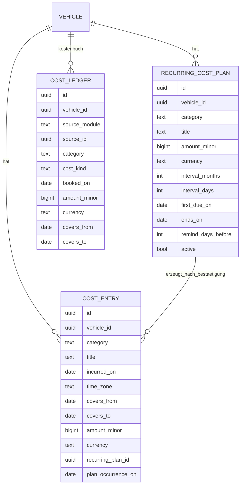

# 10 – Domänenmodell Costs (Kosten und Kennzahlen)

- **Status:** Entwurf (AP-3) · **Datum:** 2026-09-30
- **Grundlagen:** ADR-001, ADR-004, ADR-008, ADR-009, ADR-029

## 1. Zweck und Abgrenzung

Costs hat zwei Aufgaben:
1. **Sonstige Kosten erfassen**, also alles, was weder Tanken noch Werkstatt ist: Steuer, Versicherung, Gebühren, Parken, Maut, Pflege, Finanzierung, Sonstiges. Dazu kommen **wiederkehrende Kostenpläne**.
2. **Kennzahlen über alle Kosten** eines Fahrzeugs: Gesamtkosten, Kosten je Monat, je Distanz und je Tag, Wertverlust.

Damit Costs die Tabellen anderer Module nicht liest (ADR-001), führt es ein **Kostenbuch** (`cost_ledger`). Das ist eine Projektion, die aus Events von Fuel und ServiceHistory sowie aus eigenen Einträgen gespeist wird, in derselben Transaktion (ADR-004).

## 2. Datenmodell

| Feld | Regel |
|---|---|
| `category` (Eintrag/Plan) | `tax`, `insurance`, `fee`, `parking`, `toll`, `care`, `financing`, `other` |
| `incurred_on` | Kalenderdatum der Zahlung bzw. Rechnung |
| `covers_from` / `covers_to` | optionaler Leistungszeitraum (z. B. Versicherungsjahr); für die zeitanteilige Auswertung (CO-04) |
| `recurring_plan_id`, `plan_occurrence_on` | gesetzt, wenn der Eintrag aus einem Plan bestätigt wurde |
| `cost_ledger.source_module` | `fuel`, `service`, `costs` |
| `cost_ledger.category` | Kategorien oben plus `energy` (Fuel), `maintenance`, `inspection`, `repair`, `upgrade` (ServiceHistory) |
| `cost_ledger.cost_kind` | bei Service: `parts`, `labor`, `other`; sonst leer |

## 3. Invarianten

- **I-CO-1:** Intervalle eines Plans sind strikt > 0 (Check-Constraint), genau eines von Monaten oder Tagen ist gesetzt.
- **I-CO-2:** Je Paar (Plan, `plan_occurrence_on`) gibt es höchstens einen Eintrag (eindeutiger Index). Die Bestätigung ist damit idempotent.
- **I-CO-3:** Das Kostenbuch enthält je Quelle genau die aktuellen Beträge. Ein Update ersetzt die Zeilen der Quelle, ein Delete entfernt sie. Gebucht wird in der Transaktion der Quelle.
- **I-CO-4:** `covers_from ≤ covers_to`. Beide sind gesetzt oder beide leer.

## 4. Operationen

| Operation | Beschreibung | Rolle |
|---|---|---|
| `RecordCost` / `UpdateCost` / `DeleteCost` | sonstige Kosten | Bearbeiter |
| `DefinePlan` / `UpdatePlan` / `EndPlan` | wiederkehrende Kosten | Bearbeiter |
| `PendingOccurrences(vehicle)` | anstehende und offene Vorkommen (CO-02) | Leser |
| `ConfirmOccurrence(plan, datum, betrag?)` | erzeugt den Kosteneintrag, Betrag änderbar | Bearbeiter |
| `DismissOccurrence(plan, datum, grund)` | Vorkommen ohne Eintrag abschließen (z. B. Steuer entfällt) | Bearbeiter |
| `CostReport(vehicle, zeitraum, gruppierung)` | Kennzahlen CO-03 bis CO-06 | Leser |
| `FleetCostReport(user, zeitraum)` | Übersicht über alle Fahrzeuge des Nutzers | Leser |

## 5. Regeln

### CO-01 – Kostenbuch
Jede kostenrelevante Änderung in Fuel, ServiceHistory und Costs erzeugt oder ersetzt Zeilen im Kostenbuch:
- Tankvorgang: eine Zeile `energy` mit Gesamtbetrag. Ohne Betrag entsteht keine Zeile.
- Serviceeintrag: eine Zeile je Kostenposition mit `category` = Art des Eintrags und `cost_kind` = Art der Position.
- Kosteneintrag: eine Zeile mit Kategorie und Leistungszeitraum.

Alle Auswertungen lesen **nur** das Kostenbuch.

### CO-02 – Vorkommen wiederkehrender Kosten
Vorkommen: `first_due_on + k × Intervall` für k = 0, 1, 2, … bis `ends_on` bzw. bis heute + `remind_days_before`. Die Monatsaddition folgt MA-02 und rechnet immer ab `first_due_on`.
- Zustand eines Vorkommens: `upcoming` (liegt innerhalb von `remind_days_before` vor dem Datum), `open` (Datum erreicht, weder bestätigt noch verworfen), `confirmed`, `dismissed`.
- Vectra erzeugt **keine** Kosteneinträge im Hintergrund. `upcoming` und `open` erscheinen in der UI und lösen Benachrichtigungen aus (ADR-020). Einen Eintrag gibt es erst nach `ConfirmOccurrence`.
- Verkaufte Fahrzeuge (`sale` gesetzt): Vorkommen nach dem Verkaufsdatum werden nicht angeboten.
- Die Liste offener Vorkommen ist auf 24 begrenzt. Ältere werden zusammengefasst angezeigt („12 weitere offen“), damit bei lange nicht genutzten Plänen keine Flut entsteht.

### CO-03 – Summen und Gruppierung
Summen im Zeitraum `[von, bis]` (Kalenderdaten) über das Kostenbuch nach `booked_on`, **getrennt je Währung**. Gruppierungen: Kategorie, Kostenart, Monat (`JJJJ-MM`, Jahre nie zusammengelegt), Jahr. Kaufpreis und Verkaufserlös gehören **nicht** zu den laufenden Kosten, sie werden im Wertverlust ausgewiesen (CO-06).

### CO-04 – Zeitanteilige Verteilung (optional in der Ansicht)
Standard ist die Buchung zum Zahlungsdatum (`booked_on`). In der Ansicht „zeitanteilig“ wird ein Betrag mit Leistungszeitraum tagesgenau auf die Tage `covers_from … covers_to` verteilt. Der Anteil für den Auswertungszeitraum ist `Betrag × überlappende Tage / Tage des Leistungszeitraums`. Er wird erst bei der Ausgabe gerundet (half-even), sodass die Summe über alle Monate dem Betrag entspricht. Einen Rundungsrest erhält der letzte Tag.

### CO-05 – Kosten je Distanz und je Tag
- **Distanz im Zeitraum** = `DistanceBetween(von 00:00, bis+1 00:00)` in der Zeitzone des Fahrzeughalters (ODO-05). Dieselbe Funktion gilt für Monats-, Jahres- und Gesamtwerte, deshalb gibt es **keine** abweichenden Distanzdefinitionen.
- **Kosten je Distanz** = Summe / Distanz. Ist die Distanz unbekannt oder 0, wird kein Wert angezeigt, nicht 0.
- **Besitztage im Zeitraum:** Überschneidung von `[von, bis]` mit dem Besitzzeitraum `[Beginn, Ende]`. Beginn = Kaufdatum, sonst Datum des ersten Eintrags irgendeines Moduls. Ende = Tag vor dem Verkaufsdatum, sonst heute. Gezählt werden Kalendertage **inklusive** beider Grenzen.
- **Kosten je Tag** = Summe / Besitztage im Zeitraum.

### CO-06 – Wertverlust
Nur wenn Kaufpreis und Kaufdatum bekannt sind:
- Verkauft: `Wertverlust = Kaufpreis − Verkaufspreis`, `je Tag = Wertverlust / Besitztage`, `je Distanz = Wertverlust / DistanceBetween(Kauf, Verkauf)`.
- Nicht verkauft: Ohne geschätzten aktuellen Wert wird kein Wertverlust angezeigt. Ein optionaler Schätzwert (`estimated_value`, mit Datum) kann am Fahrzeug gepflegt werden und wird als „geschätzt“ gekennzeichnet.
- Kauf- und Verkaufspreis in unterschiedlichen Währungen → kein Wertverlust, Hinweis.
- Negativer Wertverlust (Wertsteigerung, z. B. Oldtimer) wird als solcher ausgewiesen, **ohne** Betragsbildung.

### CO-07 – Gesamtkosten (Total Cost of Ownership)
`TCO(Zeitraum) = laufende Kosten (CO-03) + Wertverlust (CO-06, sofern vorhanden)`, je Währung. Beide Teile werden immer einzeln mit ausgewiesen.

## 6. Domain-Events

| Event | Abnehmer |
|---|---|
| `costs.occurrence_upcoming` / `costs.occurrence_open` | Notifications |
| `costs.entry_recorded` / `updated` / `deleted` | intern (Kostenbuch) |

## 7. Soll-Beispiele

| # | Situation | Erwartung |
|---|---|---|
| C-1 | Januar 2026: Tanken 300,00 €, Service 450,00 € (Teile 200, Arbeit 250), Versicherung 600,00 € am 02.01. für 2026; Distanz Januar 1 500 km | Summe nach Zahlungsdatum 1 350,00 €; je km 0,90 € |
| C-2 | wie C-1, Ansicht zeitanteilig | Versicherung im Januar 600 × 31/365 = 50,96 €; Summe 800,96 €; je km 0,53 € |
| C-3 | Plan Kfz-Steuer 180 € jährlich, `first_due_on` 15.04.2026, `remind_days_before` 30 | ab 16.03.2026 `upcoming`, ab 15.04. `open`. Ein Eintrag entsteht erst nach Bestätigung. Doppelte Bestätigung → derselbe Eintrag (I-CO-2). |
| C-4 | Plan mit Intervall 0 | `422` (I-CO-1) |
| C-5 | Besitz seit 01.01.2026 (Kaufdatum), heute 30.09.2026 | 273 Besitztage |
| C-6 | Kauf 20 000 € am 01.01.2024, Verkauf 15 000 € am 01.01.2025, Distanz 10 000 km | Besitztage 366 (01.01.2024 bis 31.12.2024 inkl.); 13,66 €/Tag; 0,50 €/km |
| C-7 | Tanken 50 € und 40 CHF im selben Monat | zwei Summen: 50,00 EUR und 40,00 CHF; keine Gesamtsumme |
| C-8 | Distanz im Zeitraum unbekannt (keine Messpunkte) | „Kosten je km: nicht verfügbar“ |
| C-9 | Serviceeintrag wird gelöscht | seine Kostenbuch-Zeilen verschwinden in derselben Transaktion |

Rechnung zu C-2: 600 × 31 / 365 = 50,9589 → 50,96 €. Summe 300 + 450 + 50,96 = 800,96 €; 800,96 / 1 500 = 0,534 → 0,53 €/km.

## 8. Abgleich mit Phase 1 (vorläufig)

| Phase 1 | Verhalten LubeLogger (Kurzform) | Vectra | Klasse |
|---|---|---|---|
| BR-035 | überfällige wiederkehrende Gebühren erzeugen still Folgeeinträge; Intervall 0 nicht serverseitig verhindert | CO-02 Bestätigung durch den Nutzer; I-CO-1 | FIX |
| BR-036 | Gesamtkosten = Summe über Eintragstypen | CO-03 über das Kostenbuch | KEEP |
| BR-037 | Monatswerte über Jahre zusammengelegt; Distanz je Monat als Maximum über Typen | CO-03 `JJJJ-MM`, CO-05 Distanz | FIX |
| BR-038 | Distanz = größter − kleinster Stand | CO-05 über ODO-05 | FIX |
| BR-039 | Besitztage abgeschnitten, kulturabhängig geparst | CO-05 Kalendertage inklusive | FIX |
| BR-040 | Druckbericht: Kosten ohne Kraftstoff, Wertverlust mit Betrag | CO-06/CO-07; Kraftstoff wird separat ausgewiesen, Gesamtsumme vollständig | FIX |
| BR-041 | Garage-Kennzahlen | `FleetCostReport` mit CO-05 | FIX |
| BR-048 | Kiosk-Statistiken | Kiosk nicht im MVP | DROP |

## 9. Offene Punkte

- **OP-CO-1:** Währungsumrechnung für eine Gesamtsumme → nach MVP (ADR-029).
- **OP-CO-2:** Soll die zeitanteilige Ansicht (CO-04) Standard sein? Vorschlag: Standard ist das Zahlungsdatum, weil das einfacher nachzuvollziehen ist; die zeitanteilige Ansicht ist ein Umschalter.
- **OP-CO-3:** Finanzierung/Leasing (Raten, Restwert) als eigenes Modell → nach MVP; bis dahin Kategorie `financing` mit Plan.
