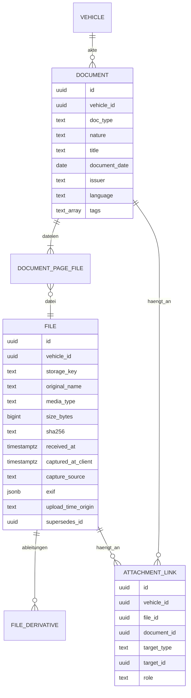

# 10 – Domänenmodell Documents (Fahrzeugakte und Anhänge)

- **Status:** Entwurf (AP-4) · **Datum:** 2026-09-30
- **Grundlagen:** Auftrag 6.7, 6.11, 6.12; ADR-011, ADR-016, ADR-017, ADR-018

## 1. Zweck und Abgrenzung

Documents verwaltet zwei Dinge:
1. **Dateien** (technisch, ADR-017): gespeicherte Objekte mit Hash, Typ und Größe, dazu Ableitungen wie Vorschaubilder.
2. **Dokumente** (fachlich, Auftrag 6.11): Einträge der digitalen Fahrzeugakte mit Dokumenttyp, Datum und Aussteller. Ein Dokument besteht aus einer oder mehreren Dateien (z. B. gescannte Seiten).

Dazu kommen **Verknüpfungen**: Dateien und Dokumente lassen sich an Einträge anderer Module hängen (Tankbeleg, Tachofoto, Rechnung zum Serviceeintrag).

Die KI-Auswertung (Textextraktion mit OCR, Embeddings, Fragen an Dokumente) gehört zum optionalen Modul Assistant (AP-10). Documents liefert ihr Dateien und Metadaten.

## 2. Datenmodell

### 2.1 Dokumenttypen (Auftrag 6.11)
| `doc_type` | Deutsch | `nature` (Default) |
|---|---|---|
| `maintenance_manual` | Wartungshandbuch | `specification` |
| `owner_manual` | Bedienungsanleitung | `specification` |
| `technical_doc` | technische Dokumentation | `specification` |
| `service_book` | Checkheft | `record` |
| `invoice` | Rechnung | `record` |
| `workshop_report` | Werkstattbericht | `record` |
| `inspection_report` | HU/TÜV-Bericht | `record` |
| `registration` | Zulassungsbescheinigung | `other` |
| `insurance` | Versicherungsunterlagen | `other` |
| `other` | Sonstiges | `other` |

`nature` unterscheidet **Herstellervorgaben** (`specification`) von **Nachweisen durchgeführter Arbeit oder festgestellter Zustände** (`record`). Der Assistent muss diese Unterscheidung einhalten: Eine Vorgabe wird nie als erledigte Wartung ausgegeben (Auftrag 6.12). Der Nutzer kann `nature` ändern.

### 2.2 Verknüpfungen
| `target_type` | Beispiele für `role` |
|---|---|
| `odometer_reading` | `odometer_display` (Tachofoto) |
| `fuel_fill` | `receipt`, `pump_display` |
| `oil_entry` | `dipstick`, `receipt` |
| `service_entry` | `invoice`, `photo`, `report` |
| `cost_entry` | `receipt`, `policy` |
| `trip` | `photo` |
| `maintenance_item` | `source` (Fundstelle der Herstellervorgabe, mit Seite) |
| `note` | `attachment` |

Eine Verknüpfung zeigt entweder auf eine Datei oder auf ein Dokument, nie auf beides.

## 3. Invarianten

- **I-DO-1:** Datei, Dokument und Verknüpfungsziel gehören zum **selben Fahrzeug**. Verknüpfungen über Fahrzeuggrenzen sind ausgeschlossen.
- **I-DO-2:** Original, `sha256`, `received_at` und `size_bytes` einer Datei sind unveränderlich (ADR-018). Eine Ersetzung ist eine neue Datei mit `supersedes_id`; die alte bleibt bis zum Ablauf der Aufbewahrungsfrist erhalten und im Audit sichtbar.
- **I-DO-3:** Binärdaten liegen nur im Storage, nie in PostgreSQL (Auftrag 6.11).
- **I-DO-4:** Ein Dokument hat mindestens eine Datei. Die Reihenfolge der Dateien ist die Seitenreihenfolge.

## 4. Operationen

| Operation | Beschreibung | Rolle |
|---|---|---|
| `UploadFile` | Datei annehmen, prüfen, Hash, EXIF, Ableitungen per Job (ADR-017/018) | Bearbeiter |
| `CreateDocument` / `UpdateDocument` / `DeleteDocument` | Fahrzeugakte pflegen | Bearbeiter |
| `AttachToEntry` / `DetachFromEntry` | Verknüpfungen | Bearbeiter |
| `ReplaceFile` | neue Fassung (I-DO-2) mit Begründung | Bearbeiter |
| `DownloadFile` / `PreviewFile` | nur nach ID-01, Header laut ADR-017 | Leser |
| `DownloadOriginal` | unverändertes Original mit EXIF | Bearbeiter (ADR-018) |
| `SearchDocuments` | DO-03 | Leser |

## 5. Regeln

### DO-01 – Dokument oder Anhang
Ein Foto, das beim Erfassen eines Eintrags aufgenommen wird (Tachofoto, Tankbeleg), ist eine **Datei mit Verknüpfung**, kein Dokument. Es erscheint beim Eintrag und in der Ansicht „Alle Dateien“. Der Nutzer kann daraus ein Dokument machen (z. B. eine Werkstattrechnung). Dann wird ein Dokument angelegt, das auf dieselbe Datei verweist; es entsteht keine Kopie.

### DO-02 – Doppelte Dateien
Wird eine Datei mit identischem `sha256` im selben Fahrzeug erneut hochgeladen, erscheint der Hinweis „bereits vorhanden als …“ mit dem Angebot, die vorhandene Datei zu verknüpfen. Gespeichert wird nur, wenn der Nutzer das ausdrücklich will.

### DO-03 – Suche (ohne KI)
Volltextsuche (PostgreSQL `tsvector`, Sprache je Dokument) über Titel, Aussteller, Schlagwörter, Notiz und, falls vorhanden, die **eingebettete Textebene** von PDFs. Diese wird per Job ohne OCR extrahiert. Filter: Typ, `nature`, Zeitraum, verknüpfte Eintragsart. OCR und semantische Suche liefert das Modul Assistant, wenn es aktiviert ist.

### DO-04 – Dokumentenhinweise im Dashboard
Hinweise, die das Dashboard anzeigt (Auftrag 6.15):
- Eine Wartung der Kategorie `legal_inspection` wurde erledigt, am Serviceeintrag hängt aber kein `inspection_report` → „HU-Bericht hinzufügen?“.
- Serviceeintrag mit Kosten > 0 ohne Rechnung → „Rechnung fehlt“ (abschaltbar).
- Kein Dokument vom Typ `maintenance_manual` → einmaliger Hinweis „Wartungshandbuch hinterlegen, damit Vorgaben erkannt werden können“ (nur bei aktiviertem Assistant).

### DO-05 – Standortdaten
EXIF-Standortdaten werden nur gespeichert, wenn die Nutzereinstellung es erlaubt, und nur angezeigt, wenn sie aktiv ist (Auftrag 6.7). Ableitungen für Vorschau und Freigabe enthalten nie EXIF (ADR-018).

### DO-06 – Löschen
Soft-Delete von Dokument bzw. Verknüpfung. Eine Datei wird erst entfernt, wenn keine Verknüpfung und kein Dokument mehr auf sie zeigt **und** die Aufbewahrungsfrist abgelaufen ist (Job, ADR-017). Löschungen werden auditiert.

## 6. Soll-Beispiele

| # | Situation | Erwartung |
|---|---|---|
| D-1 | Tachofoto beim Kilometerstand | Datei + Verknüpfung `odometer_reading`/`odometer_display`, kein Dokument |
| D-2 | Rechnung als 3 gescannte Seiten | ein Dokument `invoice` mit 3 Dateien in Reihenfolge |
| D-3 | Leser lädt Original mit EXIF | `403`; Vorschau ohne EXIF erlaubt |
| D-4 | Datei von Fahrzeug A an Eintrag von Fahrzeug B hängen | `422` (I-DO-1) |
| D-5 | gleiche PDF zweimal hochladen | Hinweis „bereits vorhanden“ |
| D-6 | HU-Wartung per Serviceeintrag erledigt, kein Bericht | Dashboard-Hinweis (DO-04) |
| D-7 | Datei mit Endung `.pdf`, Inhalt HTML | Ablehnung (Inhaltserkennung, ADR-017) |

## 7. Abgleich mit Phase 1 (vorläufig)

| Phase 1 | Verhalten LubeLogger (Kurzform) | Vectra | Klasse |
|---|---|---|---|
| 07 (Anhänge) | Anhänge als Liste aus Name und Pfad am Eintrag | Datei + Verknüpfung | FIX |
| 07 / R-03, R-04, R-12 | Dateizugriff ohne Rechteprüfung, keine Inhaltsprüfung | ADR-017, ID-01 | FIX |
| BR-058 | Verweise auf andere Einträge als Pseudo-Anhang | nicht nötig: Verknüpfungen sind typisiert | DROP |
| D-15 | Dateien bleiben nach dem Löschen verwaist | DO-06 | FIX |

## 8. Offene Punkte

- **OP-DO-1:** Erzeugen einer PDF aus mehreren gescannten Seiten (Android) → nach MVP; bis dahin mehrere Dateien je Dokument.
- **OP-DO-2:** Speicherkontingent je Konto → nach MVP; bis dahin nur Größenlimit je Datei.
