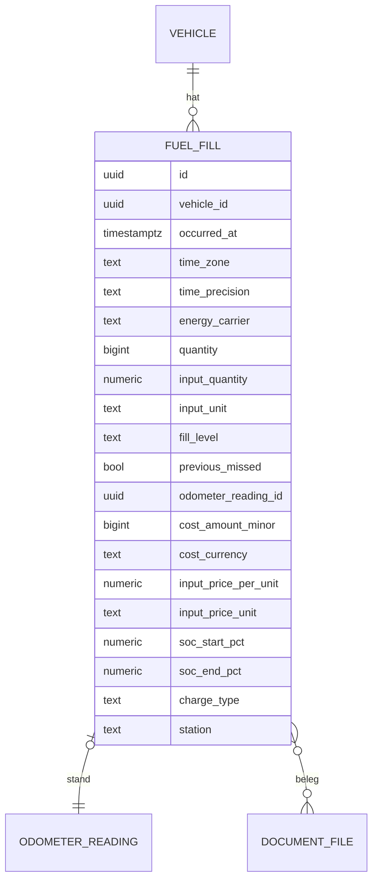

# 10 – Domänenmodell Fuel (Tanken und Laden)

- **Status:** Entwurf (AP-3) · **Datum:** 2026-09-30
- **Grundlagen:** ADR-007, ADR-008, ADR-009, ADR-010, ADR-029; Übersicht `10-domaene-uebersicht.md`

## 1. Zweck und Abgrenzung

Fuel erfasst Tank- und Ladevorgänge und berechnet daraus Verbrauch und Energiepreise. Kosten meldet das Modul per Event an Costs. Den Kilometerstand liefert Odometer.

Energieträger im MVP: `petrol`, `diesel`, `lpg` (Menge in ml) und `electricity` (Energie in Wh). Plug-in-Hybride haben zwei Energieträger; jede Verbrauchsreihe wird **getrennt je Energieträger** berechnet.

## 2. Datenmodell

| Feld | Regel |
|---|---|
| `energy_carrier` | muss in `vehicle.energy_carriers` enthalten sein |
| `quantity` | `ml` (Kraftstoff) oder `Wh` (Strom), `> 0` |
| `fill_level` | `full` oder `partial`. Bei Strom: `full` = geladen bis zum üblichen Ziel-Ladezustand. Wird für den Strom-Verbrauch nicht verwendet (FU-05). |
| `previous_missed` | Zwischen dem vorigen erfassten und diesem Vorgang wurde mindestens ein Vorgang **nicht** erfasst |
| `odometer_reading_id` | Pflicht bei `odometer_required`, sonst optional. Der Messpunkt wird mit `source = fuel` angelegt oder korrigiert (ADR-009). |
| `cost_*` | Gesamtbetrag (führend, ADR-029), optional |
| `input_price_per_unit` | nur wenn der Nutzer den Preis pro Einheit statt des Gesamtbetrags eingibt (FU-07) |
| `soc_start_pct`, `soc_end_pct` | nur Strom, optional, 0–100 |
| `charge_type` | nur Strom: `ac`, `dc`, `unknown` |
| `station` | Freitext (Tankstelle, Ladepunkt) |

## 3. Invarianten

- **I-FU-1:** `energy_carrier = electricity` ⇔ Mengeneinheit Wh. Sonst ml.
- **I-FU-2:** Sind beide Ladezustände angegeben, gilt `soc_end_pct > soc_start_pct`.
- **I-FU-3:** Ein Tankvorgang besitzt seinen Messpunkt (I-ODO-3). Wird der Tankvorgang gelöscht, wird auch der Messpunkt gelöscht.
- **I-FU-4:** Eine Änderung des Stands im Tankvorgang wird als Korrektur des Messpunkts ausgeführt (I-ODO-4), in derselben Transaktion.

## 4. Operationen

| Operation | Beschreibung | Rolle |
|---|---|---|
| `RecordFill` | anlegen; legt bei Bedarf den Messpunkt an; Plausibilität FU-08 und ODO-03 zusammen in einer Antwort | Bearbeiter |
| `UpdateFill` | ändern (If-Match) | Bearbeiter |
| `DeleteFill` | Soft-Delete inkl. Messpunkt | Bearbeiter |
| `ListFills` | mit berechnetem Intervallverbrauch je Vorgang | Leser |
| `ConsumptionSummary(zeitraum, energieträger)` | Durchschnitt, Monatswerte, Kosten pro Einheit | Leser |

## 5. Regeln

### FU-01 – Reihenfolge
Alle Berechnungen nutzen die Vorgänge **eines Energieträgers** eines Fahrzeugs in der Ordnung aus Übersicht §3.1. Gelöschte Vorgänge zählen nicht.

### FU-02 – Verbrauchsintervall (Kraftstoff)
Ein **Intervall** beginnt an einem *Anker* und endet am nächsten *Abschluss*.
- **Anker:** ein Vorgang mit `fill_level = full` und bekanntem Stand.
- **Abschluss:** der nächste spätere Vorgang mit `fill_level = full` und bekanntem Stand.
- **Menge des Intervalls:** Summe der Mengen aller Vorgänge **nach** dem Anker bis **einschließlich** des Abschlusses. Teilbetankungen und Vorgänge ohne Stand zählen dazu. Die Menge des Ankers zählt nicht, sie füllt den Tank vor dem Intervall.
- **Distanz des Intervalls:** `total(Abschluss) − total(Anker)` aus Odometer (Gesamtlaufleistung, abschnittsübergreifend).
- **Verbrauch:** `Menge / Distanz` (kanonisch ml/m). Ausgabe laut Anzeigeeinheit (ADR-007): l/100 km = `ml/m × 100`; km/l = `1 / (ml/m)`; mpg US = `3 785,411784 / (ml/m × 1 609,344)`; mpg UK analog mit 4 546,09 statt 3 785,411784.
- Jeder Abschluss ist zugleich Anker des nächsten Intervalls.

### FU-03 – Ungültige Intervalle
Ein Intervall ist **nicht berechenbar**, wenn:
- ein Vorgang **im** Intervall (nach dem Anker, einschließlich Abschluss) `previous_missed = true` hat. Der Vorgang mit dem Kennzeichen wird dann neuer Anker, sofern er voll ist und einen Stand hat, sonst der nächste volle Vorgang mit Stand;
- die Distanz ≤ 0 ist (nur nach bestätigter Anomalie möglich);
- der Stand von Anker oder Abschluss seit der letzten Berechnung ersetzt wurde. Das ist kein Sonderfall: Es gilt der jeweils gültige Messpunkt.

Nicht berechenbare Intervalle zeigt die UI mit Grund an („Tankvorgang ausgelassen“, „Distanz ≤ 0“). Mengen gehen dabei **nie still verloren**: Sie erscheinen in der Liste, fließen aber nicht in den Durchschnitt ein.

### FU-04 – Durchschnittsverbrauch
`Ø = Σ Menge / Σ Distanz` über alle **berechenbaren** Intervalle, deren Abschluss im Zeitraum liegt. Das ist ein gewichteter Durchschnitt. Mengen außerhalb abgeschlossener Intervalle (Vorgänge nach dem letzten Abschluss, erster Anker) fließen **nicht** ein.

**Monatswerte:** Ein Intervall zählt zu dem Monat, in dem sein Abschluss liegt (Zeitzone des Vorgangs). Monatswert = gewichteter Durchschnitt der Intervalle dieses Monats. Monate **verschiedener Jahre werden nie zusammengelegt**. Die Achse ist `JJJJ-MM`.

### FU-05 – Stromverbrauch
Zwei Kennzahlen, getrennt ausgewiesen:
1. **Netzbezug** (immer verfügbar, enthält Ladeverluste): wie FU-02/FU-04 mit Energie statt Menge. Als Anker/Abschluss gilt jeder Ladevorgang mit Stand, unabhängig von `fill_level`. Die Energie eines Ladevorgangs gehört zum Intervall, das **mit** ihm endet. Das ist eine Näherung und wird in der UI so beschriftet.
2. **Batterieverbrauch** (nur wenn Ladezustände und Kapazität bekannt): Für zwei aufeinanderfolgende Ladevorgänge *a* → *b* mit `a.soc_end_pct` und `b.soc_start_pct` gilt `Energie = (a.soc_end_pct − b.soc_start_pct) / 100 × Kapazität`, `Distanz = total(b) − total(a)`. Kapazität = `vehicle.battery_usable_capacity_wh`. Fehlt sie, wird **keine** Kapazität aus einzelnen Ladungen geschätzt, denn die Ladeverluste würden sie verfälschen. Die Kennzahl entfällt dann mit Hinweis. Ist `Energie ≤ 0` oder `previous_missed` bei *b*, ist das Paar nicht berechenbar.
3. Durchschnitt und Monatswerte wie FU-04, je Kennzahl getrennt.

### FU-06 – Preis pro Einheit
`Preis/Einheit = cost / quantity`, umgerechnet in die Anzeigeeinheit (€/l, €/gal, €/kWh). Dieser Wert wird nicht gespeichert. Bei `quantity = 0` ist kein Wert vorhanden; das kommt durch I-FU-Regeln nicht vor.

### FU-07 – Eingabe über Preis pro Einheit
Gibt der Nutzer Preis/Einheit (z. B. 1,799 €/l) und Menge (z. B. 55,20 l) ein, rechnet der **Server**:
`cost_amount_minor = round_half_up(input_price_per_unit × input_quantity × 10^Stellen(currency))`. Preis und Menge werden mit Einheit gespeichert, damit der Beleg nachvollziehbar bleibt. Der Client zeigt den berechneten Gesamtbetrag nur als Vorschau.

### FU-08 – Plausibilität (Muster ADR-010)
- **F1 Menge größer als Tank:** `quantity > tank_capacity × 1,10` (falls bekannt) → bestätigbare Anomalie.
- **F2 Energieträger nicht am Fahrzeug:** Ablehnung (`422`, nicht bestätigbar).
- **F3 Ladezustand widersprüchlich:** I-FU-2 verletzt → Ablehnung.
- **F4 Zeitpunkt in der Zukunft:** wie ODO-02 → Ablehnung.
- Die Befunde aus ODO-03 für den zugehörigen Messpunkt werden in **derselben** `422`-Antwort geliefert, damit der Nutzer nur einmal bestätigt.

## 6. Domain-Events

| Event | Nutzlast | Abnehmer |
|---|---|---|
| `fuel.fill_recorded` / `fuel.fill_updated` / `fuel.fill_deleted` | fill_id, vehicle_id, occurred_at, Betrag, Energieträger | Costs (Kostenbuch), Notifications (keine im MVP) |

## 7. Soll-Beispiele

**Datensatz A (Benzin, Stand = Gesamtlaufleistung, Vectra-Beispiel):**

| # | Datum | Stand km | Menge l | Füllung | ausgelassen |
|---|---|---|---|---|---|
| 1 | 01.03. | 10 000 | 40 | voll | – |
| 2 | 10.03. | 10 350 | 20 | teil | – |
| 3 | 20.03. | 10 800 | 35 | voll | – |
| 4 | 05.04. | 11 400 | 42 | voll | ja |
| 5 | 20.04. | 12 000 | 36 | voll | – |
| 6 | 30.04. | – | 10 | teil | – |
| 7 | 10.05. | 12 500 | 25 | voll | – |

| # | Erwartung |
|---|---|
| U-1 | Intervall 1→3: 55 l / 800 km = **6,88 l/100 km** (6,875); in mpg US **34,21** |
| U-2 | Intervall 3→4: nicht berechenbar („Tankvorgang ausgelassen“); 4 wird Anker |
| U-3 | Intervall 4→5: 36 l / 600 km = **6,00 l/100 km** |
| U-4 | Intervall 5→7: (10 + 25) l / 500 km = **7,00 l/100 km** (Vorgang ohne Stand zählt zur Menge) |
| U-5 | Durchschnitt: (55 + 36 + 35) / (800 + 600 + 500) = 126 l / 1 900 km = **6,63 l/100 km** |
| U-6 | Monatswerte: 2026-03 = 6,88; 2026-04 = 6,00 (Intervall 3→4 fällt aus); 2026-05 = 7,00 |
| U-7 | Eingabe 1,799 €/l × 55,20 l → Gesamtbetrag **99,30 €** (99,3048 → half-up auf Cent) |
| U-8 | Tankinhalt 50 l, Eingabe 60 l → `422` Befund F1; nach Bestätigung gespeichert |

**Datensatz B (Strom, nutzbare Kapazität 60 kWh):**

| # | Erwartung |
|---|---|
| U-9 | Ladung *a* endet bei 80 % bei 20 000 km; Ladung *b* beginnt bei 30 % bei 20 250 km → Batterieverbrauch 0,5 × 60 kWh = 30 kWh / 250 km = **12,0 kWh/100 km** |
| U-10 | Netzbezug im Mai: Intervalle mit zusammen 180 kWh und 1 200 km → **15,0 kWh/100 km** (inkl. Ladeverlusten) |
| U-11 | Kapazität unbekannt → Batterieverbrauch „nicht verfügbar“ mit Hinweis; Netzbezug wird angezeigt |

## 8. Abgleich mit Phase 1 (vorläufig)

| Phase 1 | Verhalten LubeLogger (Kurzform) | Vectra | Klasse |
|---|---|---|---|
| BR-001 | Sortierung nach Datum, dann Stand, dann Ladezustand | Ordnung nach Zeitpunkt (Übersicht §3.1) | FIX |
| BR-002 | negative Deltas werden still zu 0 | Distanz aus Odometer, Anomalien vorher bestätigt, Intervall sonst nicht berechenbar | FIX |
| BR-003 | Vollbetankung + aufsummierte Teilbetankungen; bei Menge/Distanz ≤ 0 gehen Teilmengen verloren | FU-02 (gleiches Grundprinzip), FU-03 ohne stille Verluste | FIX |
| BR-004 | Teilbetankungen aufsummieren | FU-02 | KEEP |
| BR-005 | ausgelassener Vorgang setzt Berechnung zurück | FU-03 | KEEP |
| BR-006 | erster Vorgang ohne Verbrauch | Anker ohne Verbrauch | KEEP |
| BR-007 | Vorgang ohne Stand wird wie Teilbetankung aufsummiert | FU-02 | KEEP |
| BR-008 | UK-Gallonen mit Faktor 4,546 | exakte Faktoren (ADR-007) | FIX |
| BR-009 | Strom: Kapazität je Ladung geschätzt | FU-05, Kapazität aus Fahrzeugdaten, zusätzlich Netzbezug | FIX |
| BR-010 | Preis pro Einheit | FU-06 | KEEP |
| BR-011 | Durchschnitt enthält Mengen nicht abgeschlossener Intervalle | FU-04 nur abgeschlossene Intervalle | FIX |
| BR-012 | Monatswerte ungewichtet, Jahre zusammengelegt | FU-04 gewichtet, `JJJJ-MM` | FIX |
| BR-013 | Umkehrung l/100 km ↔ km/l | Anzeigeeinheiten (ADR-007) | KEEP |
| BR-014 | Preis × Menge nur im Browser gerundet | FU-07 serverseitig | FIX |
| BR-059 | Einheiten nur Interpretation | ADR-007 | FIX |

## 9. Offene Punkte

- **OP-FU-1:** CNG/Wasserstoff (kg) → Masseeinheit in ADR-007 ergänzen, sobald ein Nutzer das braucht (nicht MVP).
- **OP-FU-2:** Soll der Netzbezug bei Ladungen ohne Stand (z. B. Wallbox-Import) über die Zeit verteilt werden? Vorschlag: nein im MVP, sie zählen zum nächsten Intervall mit Stand.
- **OP-FU-3:** Import von Wallbox-/Ladekarten-Daten (CSV) → nach MVP.
