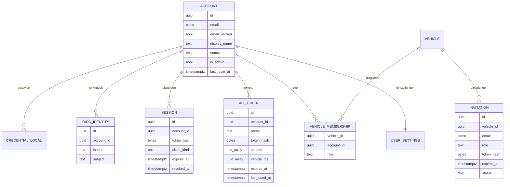

# 10 – Domänenmodell Identity (Konten, Anmeldung, Rollen)

- **Status:** Entwurf (AP-4) · **Datum:** 2026-09-30
- **Grundlagen:** Auftrag 6.2; ADR-011, ADR-015, ADR-016

## 1. Zweck und Abgrenzung

Identity verwaltet Konten, Anmeldeverfahren, Sitzungen, API-Tokens, Einladungen, Mitgliedschaften (Rollen je Fahrzeug) und Nutzereinstellungen. Das Modul stellt allen anderen Modulen die zentrale Rechteprüfung `Authorize(actor, action, vehicle_id)` bereit (ADR-016).

## 2. Datenmodell

| Entität | Wesentliche Regeln |
|---|---|
| `account.status` | `invited`, `active`, `disabled`, `deleted` |
| `account.is_admin` | Systemrolle Administrator (ADR-016). Kein Zugriff auf Fahrzeugdaten allein durch diese Rolle |
| `credential_local` | Argon2id-Hash, Parameter und Zeitpunkt der letzten Änderung (ADR-015) |
| `oidc_identity` | eindeutig je (`issuer`, `subject`) |
| `session.client_kind` | `web` (Cookie) oder `android` (Access-/Refresh-Token, ADR-015) |
| `api_token.scopes` | `vehicles:read`, `entries:write`, `entries:delete`, `sharing:manage`, `admin` (ADR-016) |
| `api_token.vehicle_ids` | optional: Beschränkung auf bestimmte Fahrzeuge |
| `vehicle_membership.role` | `owner`, `editor`, `viewer` |
| `invitation.status` | `pending`, `accepted`, `declined`, `revoked`, `expired` |
| `user_settings` | Sprache (`de`, `en`), Zeitzone, Anzeigeeinheiten, Default-Währung, Benachrichtigungswünsche je Ereignistyp und Kanal, Freigabe der EXIF-Standortanzeige, Default-Schwellen für Wartung |

## 3. Invarianten

- **I-ID-1:** Je Fahrzeug mindestens ein `owner`. Das Entfernen oder Herabstufen des letzten Eigentümers ist nicht möglich (`409`).
- **I-ID-2:** Je Installation mindestens ein aktives Konto mit `is_admin`. Der letzte Administrator kann sich nicht selbst entrechten, deaktivieren oder löschen.
- **I-ID-3:** Je (Fahrzeug, Konto) höchstens eine Mitgliedschaft.
- **I-ID-4:** E-Mail-Adressen sind je Installation eindeutig (ohne Beachtung der Groß-/Kleinschreibung).
- **I-ID-5:** Geheimnisse (Passwörter, Sitzungs-, API-, Einladungs- und Reset-Tokens) werden nur als Hash gespeichert und nie ausgegeben, außer dem API-Token einmalig bei der Erzeugung.

## 4. Operationen (Auswahl)

| Operation | Beschreibung | Wer |
|---|---|---|
| `InitialSetup` | legt das erste Admin-Konto an; nur mit Einmal-Setup-Token, nur solange kein Konto existiert (ADR-015) | Betreiber |
| `RegisterLocal` | Selbstregistrierung, nur wenn vom Admin erlaubt (Default: aus) | – |
| `LoginLocal` / `LoginOidc` / `Logout` | Anmeldung; bei OIDC Zuordnung über (`issuer`, `subject`) | – |
| `LinkOidcIdentity` | Verknüpfung nur aus einer angemeldeten Sitzung heraus | Konto selbst |
| `ChangePassword` / `RequestPasswordReset` / `ResetPassword` | Reset-Link 24 h, einmalig, beendet alle Sitzungen | Konto selbst |
| `ListSessions` / `RevokeSession` | eigene Sitzungen einsehen und beenden | Konto selbst |
| `CreateApiToken` / `RevokeApiToken` | Scopes höchstens im Umfang der eigenen Rechte | Konto selbst |
| `InviteMember(vehicle, email, role)` | Einladung mit Annahme; existiert kein Konto, wird es mit der Annahme angelegt | Eigentümer |
| `AcceptInvitation` / `DeclineInvitation` | Annahme durch den Empfänger, dessen E-Mail passen muss | Empfänger |
| `ChangeRole` / `RemoveMember` / `LeaveVehicle` | unter I-ID-1 | Eigentümer; Verlassen durch jedes Mitglied |
| `TransferOwnership` | Einladung als `owner`; nach Annahme kann der bisherige Eigentümer seine Rolle abgeben | Eigentümer |
| `DisableAccount` / `DeleteAccount` | Admin bzw. Konto selbst; siehe ID-05 | Admin / selbst |
| `UpdateSettings` | Nutzereinstellungen | Konto selbst |

## 5. Regeln

### ID-01 – Rechteprüfung
`Authorize(actor, action, vehicle_id)`:
1. Konto aktiv? Sonst `401`.
2. Rolle des Kontos am Fahrzeug laden. Ohne Mitgliedschaft antwortet der Aufruf mit `404` (ADR-013), damit nicht erkennbar ist, dass das Fahrzeug existiert.
3. Aktion laut Rollenmatrix (ADR-016) erlaubt? Sonst `403`.
4. Bei API-Token: Aktion muss zusätzlich durch die Scopes gedeckt sein, und das Fahrzeug muss in `vehicle_ids` liegen, falls die Liste gesetzt ist. Sonst `403`.
5. Die Prüfung erfolgt **am geladenen Objekt** mit dessen gespeicherter `vehicle_id`, nie an einer vom Client gesendeten ID (ADR-016).

Rollen werden bei jedem Request aus der Datenbank gelesen. Ein Entzug wirkt sofort.

### ID-02 – Sitzungsdauer
- Web: Leerlauf-Timeout 7 Tage, absolute Höchstdauer 30 Tage. „Angemeldet bleiben“ ist nicht nötig, weil die Sitzung serverseitig ist.
- Android: Access-Token 15 min, Refresh-Token 90 Tage, rotierend. Wird ein bereits verwendetes Refresh-Token erneut benutzt, werden alle Tokens dieser Kette widerrufen.
- Passwortänderung, Reset oder Deaktivierung beenden alle Sitzungen und Refresh-Tokens des Kontos.

### ID-03 – Schutz der Anmeldung
- Fehlversuche je Konto und je IP werden gezählt. Nach 5 Fehlversuchen steigt die Wartezeit exponentiell (bis 15 min). Die Antwort verrät nicht, ob die E-Mail existiert.
- Passwort mindestens 12 Zeichen und nicht in der Liste häufiger Passwörter (ADR-015).

### ID-04 – Einladungen
- Token ≥ 128 Bit, gehasht, 7 Tage gültig (Einladung) bzw. 24 h (Passwort-Reset), einmalig.
- Rolle, Fahrzeug und Einladender stehen in der Einladung. Die Annahme erzeugt die Mitgliedschaft und einen Audit-Eintrag.
- Offene Einladungen kann der Eigentümer zurückziehen.

### ID-05 – Konto löschen
- Ist das Konto **alleiniger** Eigentümer eines Fahrzeugs mit weiteren Mitgliedern, muss vorher übertragen werden (`409` mit Liste der Fahrzeuge).
- Fahrzeuge ohne weitere Mitglieder werden mit dem Konto gelöscht (Soft-Delete, Frist). Das Konto wird vorher ausdrücklich darauf hingewiesen.
- Audit-Einträge bleiben erhalten. Der Akteur wird pseudonymisiert („gelöschtes Konto #…“).

## 6. Soll-Beispiele

| # | Aktion | Erwartung |
|---|---|---|
| I-1 | Leser ruft Tankvorgang eines Fahrzeugs ab, auf dem er Mitglied ist | `200` |
| I-2 | Bearbeiter von Fahrzeug A ändert einen Tankvorgang von Fahrzeug B und sendet dabei `vehicle_id = A` | `404` (Prüfung am geladenen Objekt, B ohne Mitgliedschaft) |
| I-3 | API-Token mit nur `vehicles:read` legt Tankvorgang an | `403` |
| I-4 | letzter Eigentümer stuft sich auf Bearbeiter herunter | `409` |
| I-5 | letzter Admin deaktiviert sich | `409` |
| I-6 | Eigentümer fügt Konto ohne Einladung hinzu | nicht möglich; nur Einladung mit Annahme |
| I-7 | Rolle wird entzogen, während der Nutzer angemeldet ist | nächster Request `404` |
| I-8 | OIDC-Anmeldung mit bekannter E-Mail, aber neuem (`issuer`, `subject`) | **keine** automatische Verknüpfung; Hinweis, sich lokal anzumelden und dann zu verknüpfen |

## 7. Abgleich mit Phase 1 (vorläufig)

| Phase 1 | Verhalten LubeLogger (Kurzform) | Vectra | Klasse |
|---|---|---|---|
| BR-051 | Cookie-Laufzeit 1–90 Tage | ID-02 serverseitige Sitzung | FIX |
| R-01–R-06 | Rechte teils am falschen Objekt geprüft oder gar nicht | ID-01 | FIX |
| R-07–R-11 | schwache Hashes und Tokens, unsichere Cookies, Auth-Default aus, OIDC-Schwächen | ADR-015, ID-02 bis ID-04 | FIX |
| R-14 | Admins entrechten sich gegenseitig; Freigaben ohne Zustimmung | I-ID-2, ID-04 | FIX |

## 8. Offene Punkte

- **OP-ID-1:** Zweiter Faktor (TOTP/Passkeys) → nach MVP (ADR-015).
- **OP-ID-2:** Gruppen/Haushalte als Komfortfunktion (eine Einladung für alle Fahrzeuge) → nach MVP; bis dahin Einzelfreigaben.
