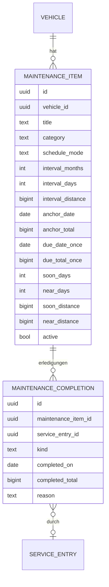

# 10 – Domänenmodell Maintenance (Wartungsdefinitionen und Fälligkeit)

- **Status:** Entwurf (AP-3) · **Datum:** 2026-09-30
- **Grundlagen:** ADR-008, ADR-009, ADR-012, ADR-019, ADR-020

## 1. Zweck und Abgrenzung

Maintenance beschreibt, **was wann fällig wird**: Ölwechsel alle 12 Monate oder 15 000 km, Zahnriemen alle 120 000 km, HU/TÜV alle 24 Monate, einmalige Aufgaben wie „Winterreifen montieren bis 15.10.“. Das Modul berechnet Fälligkeit und Dringlichkeitsstufe. Den Versand von Benachrichtigungen übernimmt Notifications (ADR-020).

Grundsatz: Die **nächste Fälligkeit wird immer berechnet** aus Definition, letzter Erledigung und aktuellem Stand. Sie wird nicht durch Seiteneffekte fortgeschrieben. Es gibt kein automatisches Verschieben überfälliger Wartungen.

## 2. Datenmodell

### 2.1 `maintenance_item`
| Feld | Regel |
|---|---|
| `category` | `service`, `legal_inspection` (HU/TÜV, AU), `tires`, `fluids`, `other` |
| `schedule_mode` | `once`, `from_last_completion` (Default), `fixed_grid` |
| `interval_months` / `interval_days` | höchstens eines von beiden gesetzt; > 0 |
| `interval_distance` | kanonisch (m bzw. s bei Stundenzähler), > 0 |
| `anchor_date`, `anchor_total` | Startpunkt, bevor es eine Erledigung gibt (z. B. Erstzulassung, Kaufdatum oder „zuletzt gemacht am“) |
| `due_date_once`, `due_total_once` | nur bei `once` |
| `soon_*`, `near_*` | eigene Schwellen der Definition; leer = Vorgabe aus Nutzereinstellung, danach Installation (MA-05) |
| `active` | inaktive Definitionen werden nicht bewertet |

### 2.2 `maintenance_completion`
| Feld | Regel |
|---|---|
| `kind` | `done` (über Serviceeintrag oder manuell) oder `skipped` (bewusst ausgelassen, Pflicht-Begründung) |
| `service_entry_id` | gesetzt, wenn die Erledigung aus einem Serviceeintrag stammt (SH-04) |
| `completed_on` | Kalenderdatum in `owner_time_zone` |
| `completed_total` | Gesamtlaufleistung zum Zeitpunkt der Erledigung (aus dem Messpunkt des Serviceeintrags oder `ValueAt`), optional |

## 3. Invarianten

- **I-MA-1:** Eine Definition hat mindestens einen Auslöser: ein Zeitintervall, ein Distanzintervall oder (bei `once`) ein Fälligkeitsdatum bzw. einen Fälligkeitsstand.
- **I-MA-2:** Intervalle sind strikt > 0. Die Datenbank prüft das per Check-Constraint.
- **I-MA-3:** Je Paar (Definition, Serviceeintrag) höchstens eine Erledigung (eindeutiger Index).
- **I-MA-4:** Distanzintervalle sind nur bei Fahrzeugen erlaubt, deren Zählergröße zur Einheit passt (`distance` ↔ Meter, `engine_hours` ↔ Sekunden).

## 4. Operationen

| Operation | Beschreibung | Rolle |
|---|---|---|
| `DefineItem` / `UpdateItem` / `DeactivateItem` / `DeleteItem` | Pflege der Definitionen | Bearbeiter |
| `Complete` | manuelle Erledigung ohne Serviceeintrag (z. B. selbst gemacht) | Bearbeiter |
| `Skip` | als ausgelassen markieren, Begründung Pflicht | Bearbeiter |
| `RecordCompletionFromService` | nur intern, aufgerufen von ServiceHistory (SH-04) | – |
| `DueStatus(vehicle)` | Fälligkeit und Stufe aller aktiven Definitionen | Leser |
| `NextDue(vehicle)` | die dringendste Definition (MA-07) | Leser |
| `DueFeed(user)` | Übersicht über alle Fahrzeuge des Nutzers; iCal-Feed nach MVP | Leser |

## 5. Regeln

### MA-01 – Maßgebliche Erledigung
Die **letzte** Erledigung einer Definition, sortiert nach `completed_on`, dann nach `completed_total`, dann nach `id`. `done` und `skipped` zählen gleich.

### MA-02 – Nächste Fälligkeit nach Zeit
Basis `B` = `completed_on` der maßgeblichen Erledigung, ohne Erledigung `anchor_date`.
- `from_last_completion`: `fällig_am = B + Intervall`.
- `fixed_grid`: `fällig_am = anchor_date + k × Intervall` mit dem kleinsten *k* ≥ 1, für das `fällig_am > B` gilt (ohne Erledigung: *k* = 1). Das Raster läuft ab dem ursprünglichen Anker. Monatsenden verschieben sich deshalb nicht dauerhaft (siehe M-5).
- **Monatsaddition:** Ist der Zieltag im Zielmonat nicht vorhanden, gilt der letzte Tag des Monats (31.01. + 1 Monat = 28.02. bzw. 29.02.).
- `once`: `fällig_am = due_date_once`. Nach einer Erledigung ist die Definition **erledigt** und wird nicht mehr bewertet.

### MA-03 – Nächste Fälligkeit nach Distanz
Basis `S` = `completed_total` der maßgeblichen Erledigung. Fehlt er, wird `ValueAt(completed_on 12:00)` aus Odometer verwendet (ODO-06). Ohne Erledigung gilt `anchor_total`.
- `from_last_completion`: `fällig_bei = S + interval_distance`.
- `fixed_grid`: `fällig_bei = anchor_total + k × interval_distance`, kleinstes *k* mit `fällig_bei > S`.
- `once`: `due_total_once`.
- Alle Werte sind **Gesamtlaufleistung**. Ein Tachotausch verschiebt die Fälligkeit deshalb nicht (ADR-009).

### MA-04 – Stufe je Auslöser
Stufen, aufsteigend: `ok` < `soon` (demnächst) < `near` (bald fällig) < `overdue` (überfällig).

**Zeit** (Kalenderdaten in `owner_time_zone`, `heute` = aktuelles Datum dort):
- `heute > fällig_am` → `overdue`. Am Fälligkeitstag selbst ist die Wartung noch nicht überfällig (ADR-008).
- `fällig_am − heute ≤ near_days` → `near`
- `fällig_am − heute ≤ soon_days` → `soon`
- sonst `ok`
- Die **Resttage** sind `fällig_am − heute` in ganzen Kalendertagen (am Fälligkeitstag 0).

**Distanz** (`aktuell` = Gesamtlaufleistung aus `Current()`, ODO-04):
- `aktuell > fällig_bei` → `overdue`. Gleichstand ist noch nicht überfällig.
- `fällig_bei − aktuell ≤ near_distance` → `near`
- `fällig_bei − aktuell ≤ soon_distance` → `soon`
- sonst `ok`
- Ist der aktuelle Stand unbekannt, ist der Auslöser **nicht bewertbar**. Die Stufe richtet sich dann allein nach dem Zeitauslöser; hat die Definition keinen, lautet sie `unknown` mit Hinweis „Kilometerstand erfassen“.

### MA-05 – Schwellen
Je Definition gelten ausschließlich **ihre eigenen** Schwellen bzw. die Vorgaben. Sie werden für jede Definition einzeln aufgelöst, nie über mehrere Definitionen hinweg geteilt. Reihenfolge der Auflösung: Definition → Nutzereinstellung → Installation.

Installationsvorgaben (Vorschlag, konfigurierbar): `soon_days` 30, `near_days` 7, `soon_distance` 1 500 km, `near_distance` 500 km. Bei Stundenzählern: 20 h / 5 h.

### MA-06 – Gesamtstufe einer Definition
Gesamtstufe = die **höchste** Stufe über alle Auslöser. Als Grund wird der Auslöser mit der höchsten Stufe angegeben. Haben beide dieselbe Stufe, wird der Auslöser genannt, der nach Prognose (MA-07) zuerst erreicht wird. Die Antwort enthält immer **beide** Restwerte (Tage und Distanz), soweit vorhanden.

### MA-07 – Nächste fällige Wartung und Prognose
`NextDue` sortiert die aktiven Definitionen nach:
1. Gesamtstufe absteigend;
2. geschätztem Fälligkeitsdatum aufsteigend. Bei Zeitauslöser gilt `fällig_am`. Bei Distanzauslöser gilt `heute + (fällig_bei − aktuell) / Tagesleistung` mit der Tagesleistung aus ODO-08. Bei beiden gilt das frühere Datum. Ohne Tagesleistung werden reine Distanzdefinitionen ans Ende gestellt.

Die geschätzten Daten sind in der API als `estimated` gekennzeichnet.

### MA-08 – Keine automatische Fortschreibung
Eine überfällige Definition bleibt überfällig, bis sie erledigt (`done`) oder ausgelassen (`skipped`) wird. Lesezugriffe ändern nie Daten.

### MA-09 – Neubewertung und Benachrichtigung
Die Stufen werden **nicht gespeichert**, sondern bei Abfrage berechnet. Für Benachrichtigungen läuft ein periodischer Job (stündlich, ADR-019). Zusätzlich wird bei `odometer.*`- und Erledigungs-Events sofort neu bewertet. Ein Wechsel auf eine höhere Stufe erzeugt ein Ereignis `maintenance.level_raised(item, stufe)`. Notifications dedupliziert persistent nach (Empfänger, Definition, Stufe, Fälligkeitswert). Nach einer Erledigung ändert sich der Fälligkeitswert, und dieselbe Stufe darf für die neue Fälligkeit wieder gemeldet werden.

## 6. Soll-Beispiele

Definition „Ölwechsel“: `from_last_completion`, 12 Monate / 15 000 km. Letzte Erledigung am 10.03.2026 bei 45 000 km. Vorgaben aus MA-05.

| # | Situation | Erwartung |
|---|---|---|
| M-1 | Fälligkeit | `fällig_am` = 10.03.2027, `fällig_bei` = 60 000 km |
| M-2 | heute 30.09.2026, aktuell 58 700 km | Distanz: Rest 1 300 km ≤ 1 500 → `soon`; Zeit: Rest 161 Tage → `ok`; Gesamt `soon`, Grund Distanz |
| M-3 | aktuell 59 600 km | Rest 400 km ≤ 500 → `near` |
| M-4 | aktuell 60 000 km | Gleichstand → `near` (nicht überfällig); bei 60 001 km → `overdue` |
| M-5 | `fixed_grid` monatlich, Anker 31.01.2026, keine Erledigung, danach Erledigung am 28.02. | Fälligkeiten 28.02. → 31.03. → 30.04. (Raster ab Anker, kein Abrutschen auf den 28.) |
| M-6 | Zeitauslöser fällig am 10.03.2027 | am 10.03.2027 `near` mit 0 Resttagen; am 11.03.2027 `overdue` |
| M-7 | Definition A: eigene Schwelle `soon_days` 365, fällig in 200 Tagen; danach Definition B mit Vorgaben, fällig in 100 Tagen | A → `soon`; B → `ok`. Schwellen gelten nie für andere Definitionen. |
| M-8 | Serviceeintrag vom 12.03.2027 bei 60 400 km erledigt „Ölwechsel“ | neue Fälligkeit 12.03.2028 / 75 400 km. Das Löschen des Eintrags stellt M-1 wieder her. |
| M-9 | HU: `from_last_completion`, 24 Monate, nur Zeit; überfällig seit 3 Monaten | bleibt `overdue` bis zur Erledigung (MA-08) |
| M-10 | Tachotausch nach der Erledigung (Offset 130 000 km) | `fällig_bei` bleibt als Gesamtlaufleistung gleich. Die UI zeigt zusätzlich den Zählerwert des neuen Instruments. |
| M-11 | nächste Wartung: Zeit-Definition in 30 Tagen `soon`, km-Definition Rest 1 000 km bei 50 km/Tag (≈ 20 Tage) `soon` | `NextDue` = km-Definition (gleiche Stufe, früheres geschätztes Datum) |

## 7. Abgleich mit Phase 1 (vorläufig)

| Phase 1 | Verhalten LubeLogger (Kurzform) | Vectra | Klasse |
|---|---|---|---|
| BR-026 | Fälligkeit nach Datum ab 00:00:01 am Fälligkeitstag überfällig, Resttage um 1 zu klein | MA-04 Kalenderlogik | FIX |
| BR-027 | Stufen nach Distanz, Gleichstand nicht überfällig | MA-04; Gleichstand bleibt nicht überfällig | KEEP |
| BR-028 | „Beides“ – was zuerst erreicht wird | MA-06 höchste Stufe | KEEP |
| BR-029 | eigene Schwellen wirken auf nachfolgende Einträge; Distanzschwellen 100/50 ohne Einheit | MA-05 je Definition; Schwellen mit Einheit | FIX |
| BR-030 | Auswahl der nächsten Fälligkeit mischt Metriken | MA-07 | FIX |
| BR-031 | Fortschreibung ab Erledigung oder festem Intervall | MA-02/MA-03 (berechnet statt fortgeschrieben), Raster ab Anker | FIX |
| BR-032 | überfällige Einträge werden beim Seitenaufruf verschoben | MA-08: keine automatische Fortschreibung | DROP |
| BR-033 | Erledigung durch Einträge ohne gespeicherte Verknüpfung | SH-04 / MA-01 | FIX |
| BR-034 | Deduplizierung nur im Speicher | MA-09 + ADR-020 persistent | FIX |
| BR-053 | iCal-Export | nach MVP (`DueFeed`) | offen |

## 8. Offene Punkte

- **OP-MA-1:** Vorlagen für typische Wartungspläne je Fahrzeugtyp (z. B. „PKW Standard“)? Vorschlag: eigene, neu formulierte Vorlagen nach MVP.
- **OP-MA-2:** Schwellen für `soon_distance`/`near_distance` fachlich bestätigen (Vorschlag 1 500 / 500 km).
