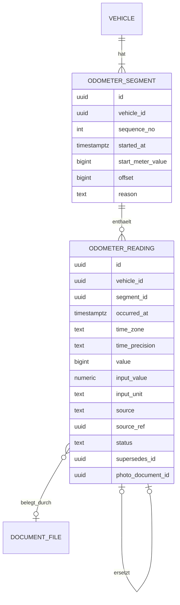

# 10 – Domänenmodell Odometer (Kilometerstand)

- **Status:** Entwurf (AP-3) · **Datum:** 2026-09-30
- **Grundlagen:** ADR-007, ADR-008, ADR-009, ADR-010, ADR-011

## 1. Zweck und Abgrenzung

Odometer ist die **einzige Quelle** für Zählerstände eines Fahrzeugs. Das Modul beantwortet drei Fragen:
1. Welcher Stand galt zum Zeitpunkt *t*?
2. Welche Strecke (bzw. Betriebszeit) liegt zwischen *t₁* und *t₂*?
3. Was ist der aktuelle Stand?

Andere Module speichern **keinen eigenen Stand**. Sie verweisen auf einen Messpunkt.

Nicht im MVP: Übertragen von Distanzen auf andere Fahrzeuge (Anhänger), Laufleistung von Ausstattung und fester Umrechnungsfaktor für abweichende Tachos (ADR-009 Punkt 7).

## 2. Begriffe

| Begriff | Bedeutung |
|---|---|
| **Messpunkt** (`odometer_reading`) | abgelesener Zählerwert zu einem Zeitpunkt, mit Herkunft |
| **Zählerwert** | Wert, den das Instrument anzeigt |
| **Zählerabschnitt** (`odometer_segment`) | Zeitraum, in dem ein Instrument gilt. Ein neuer Abschnitt beginnt bei Tachotausch oder Überlauf. |
| **Gesamtlaufleistung** | Zählerwert + Versatz des Abschnitts. Alle Berechnungen nutzen diesen Wert. |
| **gültig** | Messpunkt mit Status `valid` oder `confirmed_anomaly` und ohne Soft-Delete |

## 3. Datenmodell

### 3.1 `odometer_segment`
| Feld | Typ | Regel |
|---|---|---|
| `sequence_no` | int | 1, 2, 3 …, je Fahrzeug eindeutig |
| `started_at` | timestamptz | Abschnitt 1: `-infinity`, danach Einbauzeitpunkt |
| `start_meter_value` | bigint | Zählerwert des neuen Instruments beim Einbau (oft 0) |
| `offset` | bigint | Versatz, der zum Zählerwert addiert die Gesamtlaufleistung ergibt. Abschnitt 1: 0 |
| `reason` | `initial` \| `replacement` \| `rollover` | |

### 3.2 `odometer_reading`
| Feld | Regel |
|---|---|
| `value` | Zählerwert kanonisch (`m` oder `s` je `usage_meter`), `>= 0` |
| `segment_id` | wird serverseitig aus `occurred_at` bestimmt, nicht vom Client |
| `source` | `manual`, `fuel`, `oil`, `trip_start`, `trip_end`, `service`, `import`, `assistant` |
| `source_ref` | ID des Eintrags, zu dem der Messpunkt gehört (bei `manual`: leer) |
| `status` | `valid`, `confirmed_anomaly`, `superseded` |
| `anomalies` | bei `confirmed_anomaly`: bestätigte Befunde (`P1`–`P3`) mit Begründung |

## 4. Invarianten

- **I-ODO-1:** Jedes Fahrzeug hat genau einen Abschnitt mit `sequence_no = 1`. Die `started_at`-Werte der Abschnitte sind streng steigend.
- **I-ODO-2:** Der Abschnitt eines Messpunkts ist der Abschnitt mit dem größten `started_at ≤ occurred_at`.
- **I-ODO-3:** Ein Messpunkt mit `source ≠ manual` gehört seinem Quelleintrag. Ändern oder Löschen läuft über den Quelleintrag, nicht direkt.
- **I-ODO-4:** Eine Korrektur legt einen neuen Messpunkt an: Der neue verweist über `supersedes_id` auf den alten, der alte erhält `superseded`. Ein Messpunkt wird höchstens einmal ersetzt. Die Korrektur übernimmt `source` und `source_ref` des alten Messpunkts, der Quelleintrag verweist ab dann auf den neuen.
- **I-ODO-5:** Bei Fahrzeugen mit `odometer_required = true` gibt es keine Einträge ohne Messpunkt. Ob ein Stand fehlen darf, entscheidet das Quellmodul.

## 5. Operationen

| Operation | Beschreibung | Rolle |
|---|---|---|
| `RecordReading` | Messpunkt anlegen (manuell oder durch ein Quellmodul) mit Plausibilitätsprüfung ODO-03 | Bearbeiter |
| `CorrectReading` | Korrektur nach I-ODO-4, erneut mit Plausibilitätsprüfung | Bearbeiter |
| `DeleteReading` | nur `source = manual`; Soft-Delete | Bearbeiter |
| `StartSegment` | Tachotausch oder Überlauf erfassen (ODO-07) | Bearbeiter |
| `ValueAt(t)` | Stand zum Zeitpunkt *t* (ODO-06) | Leser |
| `DistanceBetween(t₁, t₂)` | Strecke im Intervall (ODO-05) | Leser |
| `Current()` | aktueller Stand (ODO-04) | Leser |
| `ListReadings` | Historie inkl. ersetzter Messpunkte (Filter) | Leser |

Andere Module rufen ausschließlich diese Operationen auf (ADR-001).

## 6. Regeln

### ODO-01 – Umrechnung der Eingabe
`value = round_half_even(input_value × Faktor(input_unit))` (Übersicht §3.2). Die Eingabeeinheit muss zur Größe des Fahrzeugs passen (`km`/`mi` bei `distance`, `h` bei `engine_hours`), sonst `422`.

### ODO-02 – Zukunftszeitpunkt
`occurred_at > jetzt + 5 min` → Ablehnung (`422`, nicht bestätigbar). Bei `date_only` wird statt der Uhrzeit das Kalenderdatum in `time_zone` geprüft: Liegt es nach dem heutigen Datum, wird abgelehnt.

### ODO-03 – Plausibilität gegenüber Nachbarn (ADR-010)
Die Prüfung vergleicht mit dem **vorigen** und dem **nächsten** gültigen Messpunkt desselben Abschnitts in der Ordnung nach Übersicht §3.1. Ein Messpunkt, der gerade ersetzt wird, zählt nicht mit.
- **P1 rückläufig:** `value < vorher.value`.
- **P2 überholt Folgewert:** `value > nachher.value`.
- **P3 unrealistischer Sprung:** Geschwindigkeit zu einem Nachbarn > `v_max` (Default 250 km/h, konfigurierbar; bei `engine_hours`: Betriebszeit > verstrichene Zeit × 1,0).
  - Geschwindigkeit = `|Δvalue| / Δt`.
  - Ist einer der beiden Messpunkte `date_only`, gilt `Δt = (Kalendertage-Differenz + 1) × 24 h`, also der größtmögliche Abstand. Sonst gilt `Δt` aus den Zeitstempeln, mindestens 1 Minute.
- **Gleichstand** (`value = Nachbar.value`) ist **keine** Anomalie.
- Befunde führen zu `422` mit Liste. Wird mit `confirm_anomalies` und Begründung bestätigt, lautet der Status `confirmed_anomaly` (Audit).

### ODO-04 – Aktueller Stand
Der gültige Messpunkt mit der **spätesten Ordnung** im **aktuellen** Abschnitt (größte `sequence_no`). Ausgegeben werden Zählerwert und Gesamtlaufleistung. Hat der aktuelle Abschnitt noch keinen Messpunkt, gilt `start_meter_value` zum Zeitpunkt `started_at`. Hat das Fahrzeug gar keinen Messpunkt, ist der Stand „unbekannt“ (nicht 0).

### ODO-05 – Distanz im Intervall
`DistanceBetween(t₁, t₂) = ValueAt(t₂).total − ValueAt(t₁).total` mit `t₁ ≤ t₂`. Ist einer der beiden Werte unbekannt, ist die Distanz unbekannt, nicht 0. Wegen der Interpolation (ODO-06) sind Distanzen über aneinandergrenzende Intervalle **additiv**: Die Summe der Monatsdistanzen ergibt die Jahresdistanz.

### ODO-06 – Stand zu einem Zeitpunkt (Interpolation)
Grundlage sind alle gültigen Messpunkte des Fahrzeugs über alle Abschnitte, jeweils mit Gesamtlaufleistung.
- Gibt es einen Messpunkt genau bei *t*, gilt sein Wert. Bei mehreren gilt der letzte in der Ordnung.
- Liegt *t* zwischen zwei Messpunkten *a* und *b*: `total(t) = total(a) + (total(b) − total(a)) × (t − a.t) / (b.t − a.t)`. Ist `total(b) < total(a)` (bestätigte rückläufige Anomalie), gilt stückweise konstant `total(a)`. Die Kennzeichnung „interpoliert“ wird mitgeliefert.
- Liegt *t* vor dem ersten Messpunkt: unbekannt. Liegt *t* nach dem letzten: Wert des letzten, gekennzeichnet als „fortgeschrieben“. Extrapoliert wird nicht.
- Kanonische Rundung des Ergebnisses: `round_half_even` auf ganze Meter bzw. Sekunden.

### ODO-07 – Zählerabschnitt beginnen
Eingaben: Zeitpunkt `started_at`, letzter Zählerwert des alten Instruments `old_final_value` (wird als Messpunkt `manual` im alten Abschnitt erfasst, falls noch nicht vorhanden) und `start_meter_value` des neuen Instruments.
- `offset_neu = (old_final_value + offset_alt) − start_meter_value`
- `reason = rollover`: Der Überlauf eines mechanischen Zählers wird genauso erfasst (z. B. 99 999 → 0).
- Messpunkte nach `started_at`, die bisher dem alten Abschnitt zugeordnet waren, werden neu zugeordnet und erneut geprüft. Neue Anomalien werden gemeldet, bevor die Operation gespeichert wird.
- Ein Abschnitt kann nur gelöscht werden, wenn er keine Messpunkte enthält.

### ODO-08 – Durchschnittliche Tagesleistung (für Prognosen)
Wird von Maintenance genutzt, um kilometerbasierte Fälligkeiten in ein geschätztes Datum umzurechnen: `DistanceBetween(jetzt − 90 Tage, jetzt) / 90` pro Tag. Gibt es weniger als zwei gültige Messpunkte in diesem Fenster, wird der Zeitraum ab dem ersten Messpunkt genutzt (mindestens 14 Tage), sonst ist der Wert unbekannt.

## 7. Domain-Events

| Event | Nutzlast | Abnehmer |
|---|---|---|
| `odometer.reading_recorded` | reading_id, vehicle_id, occurred_at, total | Maintenance (Fälligkeit neu bewerten) |
| `odometer.reading_corrected` | alt/neu | Maintenance, Costs (Kennzahlen-Cache) |
| `odometer.reading_deleted` | reading_id | wie oben |
| `odometer.segment_started` | segment_id, offset | Maintenance |

## 8. Soll-Beispiele (Grundlage der Regressionstests)

| # | Ausgangslage | Aktion | Erwartung |
|---|---|---|---|
| O-1 | 10.03. 12:00 → 45 000 km | 12.03. 08:00 → 44 500 km | `422`, Befund P1. Nach Bestätigung `confirmed_anomaly`; `Current()` = 44 500 km (spätester Messpunkt, nicht das Maximum) |
| O-2 | 01.03. 10:00 → 10 000 km | 01.03. 11:00 → 10 400 km | P3 (400 km/h > 250 km/h) |
| O-3 | 01.03. (date_only) → 10 000 km | 02.03. (date_only) → 10 900 km | keine Anomalie: Δt = 48 h, 18,75 km/h |
| O-4 | 01.03. → 10 000 km | 01.03. → 10 000 km (Beleg ohne Uhrzeit) | keine Anomalie (Gleichstand) |
| O-5 | Abschnitt 1, letzter Wert 180 000 km | Tachotausch 01.06., neues Instrument zeigt 50 000 km | Abschnitt 2 mit `offset` = 130 000 km. Späterer Messpunkt 52 000 km → Anzeige 52 000, Gesamtlaufleistung 182 000 |
| O-6 | 01.01. 00:00 → 10 000; 31.01. 00:00 → 13 000 km | `ValueAt(16.01. 00:00)` | 11 500 km (interpoliert) |
| O-7 | 01.01. → 10 000; 20.01. → 12 000; 10.02. → 14 100 km (jeweils 00:00) | `DistanceBetween(01.01., 01.02.)` | Stand 01.02. = 12 000 + 2 100 × 12/21 = 13 200 km; Distanz Januar = 3 200 km |
| O-8 | nur ein Messpunkt 01.05. → 20 000 km | `DistanceBetween(01.04., 01.06.)` | unbekannt (vor dem ersten Messpunkt), nicht 0 |
| O-9 | Messpunkt aus Tankvorgang | `DeleteReading` direkt | `409`: gehört zu Tankvorgang (I-ODO-3) |
| O-10 | 2 000 km am 01.01., Tippfehler 20 000 km am 05.01. (bestätigt), Korrektur auf 2 400 km | `Current()` | 2 400 km; der Messpunkt mit 20 000 km ist `superseded` und im Audit sichtbar |

Rechnung zu O-7: Zwischen 20.01. und 10.02. liegen 21 Tage. Vom 20.01. bis zum 01.02. sind es 12 Tage, also 12 000 + (14 100 − 12 000) × 12/21 = 13 200.

## 9. Abgleich mit Phase 1 (vorläufig, verbindlich in AP-5)

| Phase 1 | Verhalten LubeLogger (Kurzform) | Vectra | Klasse |
|---|---|---|---|
| BR-015 | aktueller Stand = Maximum über mehrere Eintragstypen | spätester gültiger Messpunkt (ODO-04) | FIX |
| BR-016 | Minimum über Typen | entfällt; Distanzen über ODO-05 | FIX |
| BR-017/BR-018 | Vorbelegung und Startwert aus dem Maximum | Vorbelegung in der UI mit `ValueAt(t)`; kein gespeicherter Startwert | FIX |
| BR-019/BR-020 | gespeicherte Einzeldistanzen, Neuberechnung manuell | Distanz wird immer berechnet (ODO-05) | FIX |
| BR-021 | keine Plausibilitätsprüfung | ODO-02, ODO-03 | FIX |
| BR-022 | Korrektur mit Differenz und Faktor, drei Rundungsvarianten | Zählerabschnitte (ODO-07); Faktor nicht im MVP | FIX |
| BR-023 | Distanz auf andere Fahrzeuge übertragen | nicht im MVP | DROP |
| BR-024/BR-025 | Laufleistung Ausstattung | Ausstattung nicht im MVP (E-5) | DROP |
| BR-060 | Report-Distanz als Summe der Einzeldistanzen | ODO-05, einheitlich für alle Kennzahlen | FIX |

## 10. Offene Punkte

- **OP-ODO-1:** Default für `v_max` bei Motorrädern/Nutzfahrzeugen anpassen? Vorschlag: bleibt eine globale Einstellung.
- **OP-ODO-2:** Import von LubeLogger-Daten mit Tachokorrektur (Differenz/Faktor): Die Rohwerte werden als Zählerwerte übernommen. Ob daraus Abschnitte abgeleitet werden, legt das Migrationskonzept fest (AP-7).
