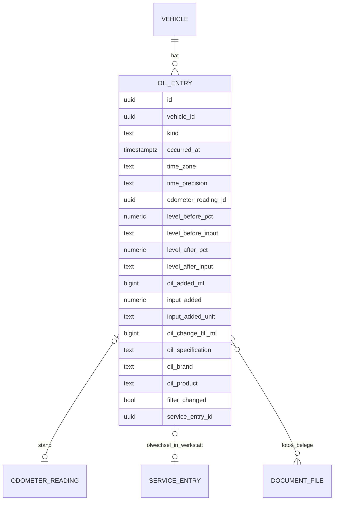

# 10 – Domänenmodell Oil (Ölstand, Nachfüllung, Ölwechsel)

- **Status:** Entwurf (AP-4) · **Datum:** 2026-09-30
- **Grundlagen:** Auftrag 6.6; Entscheidung E-13; ADR-007, ADR-009, ADR-010, ADR-018
- **Neu gegenüber LubeLogger:** Dafür gibt es kein Vorbild in der Altanwendung, deshalb auch keinen Phase-1-Abgleich.

## 1. Zweck und Abgrenzung

Oil erfasst Ölstandsmessungen, Nachfüllungen und Ölwechsel und berechnet daraus Nachfüllrate und Ölverbrauch. Ein Ölwechsel ist ein eigener Ereignistyp und beginnt eine **neue Messreihe** (Auftrag 6.6).

Ein Ölwechsel in der Werkstatt wird zusätzlich als Serviceeintrag erfasst (Kosten, Erledigung der Wartung „Ölwechsel“). Beide Einträge können verknüpft werden. Oil selbst führt keine Kosten. Die Kosten gekauften Nachfüllöls werden als sonstige Kosten erfasst (Costs, Kategorie `other`) oder dem Serviceeintrag zugeordnet.

## 2. Datenmodell

| Feld | Regel |
|---|---|
| `kind` | `check` (nur Messung), `top_up` (Nachfüllung), `oil_change` (Ölwechsel) |
| `level_before_pct` | gemessener Ölstand (`measured_oil_level`, Auftrag 6.6) **vor** einer Nachfüllung bzw. bei der Messung. Skala nach E-13: 0 % = Min-Markierung, 100 % = Max-Markierung. Werte unter Min oder über Max sind erlaubt (z. B. −10 %, 110 %). |
| `level_*_input` | Eingabeart: `percent` oder Stufe `min`, `quarter`, `half`, `three_quarters`, `max` (→ 0, 25, 50, 75, 100 %), `below_min`, `above_max` (→ bei der Berechnung nicht verwendbar, siehe OI-02) |
| `level_after_pct` | optional gemessener Stand **nach** Nachfüllung bzw. Ölwechsel |
| `oil_added_ml` | nur `top_up`, `> 0`; Eingabe mit Einheit (`ml`, `l`, `qt_us`, `qt_imp`) |
| `oil_change_fill_ml` | nur `oil_change`: eingefüllte Gesamtmenge (optional) |
| `oil_specification` | z. B. „0W-30, ACEA C3, VW 504 00“; Vorbelegung aus dem letzten Eintrag |
| `oil_brand`, `oil_product` | optional |
| `filter_changed` | nur `oil_change` |
| Fotos | Peilstabfoto als Beweisfoto mit Rolle `dipstick` (ADR-018), Kaufbeleg als `receipt` |

**Anforderung an Vehicles:** zusätzliche optionale Attribute `oil_dipstick_range_ml` (Ölmenge zwischen Min- und Max-Markierung, z. B. 1 000 ml) und `oil_capacity_ml` (Füllmenge bei Ölwechsel mit Filter).

Einheiten: `qt_us` = 946,352946 ml, `qt_imp` = 1 136,5225 ml. Diese Einheiten werden in ADR-007 ergänzt.

## 3. Invarianten

- **I-OI-1:** `top_up` hat `oil_added_ml > 0`. `check` hat einen gemessenen Stand und keine Menge.
- **I-OI-2:** Ein Eintrag besitzt seinen Messpunkt (`source = oil`, I-ODO-3). Der Stand ist Pflicht bei `odometer_required`.
- **I-OI-3:** `oil_change` mit Verknüpfung zu einem Serviceeintrag: Beide gehören zum selben Fahrzeug. Die Verknüpfung ist optional und wird beim Löschen einer Seite entfernt.

## 4. Operationen

| Operation | Beschreibung | Rolle |
|---|---|---|
| `RecordOilEntry` / `UpdateOilEntry` / `DeleteOilEntry` | inkl. Messpunkt und Fotos | Bearbeiter |
| `ListOilEntries` | mit Messreihe und berechnetem Paarverbrauch | Leser |
| `OilStatistics(zeitraum)` | OI-01, OI-03, OI-04 | Leser |
| `OilSeries(vehicle)` | Messreihen mit Kennzahlen | Leser |

## 5. Regeln

### OI-00 – Messreihe
Eine Messreihe beginnt mit einem `oil_change` und endet vor dem nächsten. Einträge vor dem ersten erfassten Ölwechsel bilden die Reihe „vor erstem erfassten Ölwechsel“. Zugeordnet wird nach der Ordnung aus Übersicht §3.1. Der Ölwechsel selbst ist der erste Eintrag seiner Reihe.

### OI-01 – Nachfüllrate im Zeitraum (Formel laut Auftrag 6.6)
`Nachfüllrate = Σ oil_added_ml (top_up im Zeitraum) / DistanceBetween(von, bis) × 1 000 km`

Ausgabe in ml bzw. l je 1 000 km (oder qt je 1 000 mi).
- **Randfall Distanz unbekannt** (kein Messpunkt vor oder im Zeitraum): kein Wert, Anzeige „nicht verfügbar“.
- **Randfall Distanz = 0** (Fahrzeug stand): kein Wert (keine Division durch 0). Angezeigt wird die Gesamtmenge.
- **Randfall keine Nachfüllung, Distanz > 0:** Ergebnis **0 ml/1 000 km**. Das ist ein gültiger Wert.
- **Randfall Ölwechsel im Zeitraum:** Die Einfüllmenge beim Ölwechsel zählt **nicht** zur Nachfüllmenge. Nachfüllungen beider Reihen zählen. Das Ergebnis erhält den Hinweis „Ölwechsel im Zeitraum“.
- Die Nachfüllrate misst, **was nachgefüllt wurde**, nicht den tatsächlichen Verbrauch (Ölstand kann sinken, ohne dass nachgefüllt wird). Den Verbrauch liefert OI-02.

### OI-02 – Verbrauch zwischen zwei Einträgen
Betrachtet werden zwei Einträge *a* und *b* derselben Messreihe mit *a* vor *b*, für die gilt:
- *a* hat einen verwertbaren **Stand danach** `L_nach(a)`:
  - bei `check`: `level_before_pct`;
  - bei `top_up` oder `oil_change`: `level_after_pct`, falls gemessen. Sonst bei `top_up` berechnet: `level_before_pct + oil_added_ml / oil_dipstick_range_ml × 100`, falls beides vorhanden. Bei `oil_change` ohne Messung gibt es keinen Wert; es wird **nicht** angenommen, dass bis Max gefüllt wurde.
- *b* hat einen verwertbaren **Stand davor** `L_vor(b)` = `level_before_pct`.
- Stufen `below_min`/`above_max` sind nicht verwertbar.
- Paare werden nur aus **aufeinanderfolgenden** verwertbaren Punkten gebildet. Einträge dazwischen ohne verwertbaren Stand fließen nur mit ihrer Nachfüllmenge ein.

Formeln:
- `Pegelabfall_pct = L_nach(a) − L_vor(b)`
- `Verbrauch_ml = Pegelabfall_pct / 100 × oil_dipstick_range_ml + Σ oil_added_ml der Einträge strikt zwischen a und b`
- `Distanz = total(b) − total(a)` (ODO)
- `Verbrauch je 1 000 km = Verbrauch_ml / Distanz × 1 000 km`

Randfälle:
- **`oil_dipstick_range_ml` unbekannt:** Ergebnis nur in **Prozentpunkten je 1 000 km**, gekennzeichnet. Liegen Nachfüllungen dazwischen, ist das Paar nicht berechenbar, weil ml und Prozent nicht addierbar sind.
- **Distanz ≤ 0 oder unbekannt:** Paar nicht berechenbar.
- **Negativer Verbrauch** (Stand gestiegen ohne Nachfüllung): Wert wird ausgewiesen und gekennzeichnet („Messung ungenau oder Kraftstoffeintrag ins Öl prüfen“). Er fließt in OI-04 ein, weil Messschwankungen sich im Mittel ausgleichen.
- **Ölwechsel zwischen a und b:** Das kann durch OI-00 nicht vorkommen. Paare überschreiten nie eine Messreihe.

### OI-03 – Gesamtmengen im Zeitraum
- Nachgefüllt: `Σ oil_added_ml` (`top_up`), Anzahl Nachfüllungen.
- Ölwechsel: Anzahl, `Σ oil_change_fill_ml` (soweit erfasst).
- Beides getrennt ausgewiesen.

### OI-04 – Entwicklung über die Zeit
- **Je Messreihe:** gewichteter Verbrauch `Σ Verbrauch_ml / Σ Distanz × 1 000` über alle berechenbaren Paare (OI-02), dazu Laufleistung seit Ölwechsel.
- **Verlauf:** Paarverbräuche als Punkte über der Gesamtlaufleistung (x = Mitte des Paares). Zusätzlich die Nachfüllrate je Monat `JJJJ-MM` (OI-01).
- **Zu wenige Einträge:** Hat eine Reihe weniger als zwei verwertbare Stände, zeigt sie „zu wenige Messungen (mindestens 2 nötig)“ statt eines Werts.
- Ein Hinweis erscheint, wenn der Verbrauch der aktuellen Reihe den Median der letzten drei abgeschlossenen Reihen um mehr als 50 % übersteigt. Das ist ein reiner Hinweis ohne Wertung; der Grenzwert ist konfigurierbar.

### OI-05 – Plausibilität (Muster ADR-010)
- `level_*_pct` außerhalb −50 … 150 % → Ablehnung.
- `oil_added_ml > oil_capacity_ml` (falls bekannt) → bestätigbare Anomalie „Menge größer als Füllmenge“.
- Berechneter Stand nach Nachfüllung > 120 % → bestätigbarer Hinweis „möglicherweise überfüllt“.
- Messpunkt: ODO-03 in derselben Antwort.

## 6. Domain-Events

| Event | Abnehmer |
|---|---|
| `oil.entry_recorded` / `updated` / `deleted` | Vehicles-Dashboard (Cache), Notifications (Hinweis aus OI-04, nach MVP) |
| `oil.oil_change_recorded` | Maintenance: **kein** automatisches Erledigen. Die UI schlägt vor, die Wartung „Ölwechsel“ über einen Serviceeintrag zu erledigen. |

## 7. Soll-Beispiele

Fahrzeug: `oil_dipstick_range_ml` = 1 000 ml, `oil_capacity_ml` = 4 300 ml.

| # | Datum | Art | Stand km | Stand vor | nachgefüllt | Stand nach |
|---|---|---|---|---|---|---|
| 1 | 20.02. | check | 49 800 | 60 % | – | – |
| 2 | 01.03. | oil_change | 50 000 | – | (4 300 ml Einfüllmenge) | 100 % (gemessen) |
| 3 | 01.04. | check | 51 500 | 70 % | – | – |
| 4 | 20.04. | top_up | 52 500 | 40 % | 500 ml | (berechnet 90 %) |
| 5 | 15.05. | check | 54 000 | 60 % | – | – |

| # | Erwartung |
|---|---|
| L-1 | Kein Paar 1→2 (Messreihe endet am Ölwechsel, OI-00) |
| L-2 | Paar 2→3: (100 − 70) % = 300 ml / 1 500 km = **200 ml/1 000 km** |
| L-3 | Paar 3→4: (70 − 40) % = 300 ml / 1 000 km = **300 ml/1 000 km** |
| L-4 | Paar 4→5: (90 − 60) % = 300 ml / 1 500 km = **200 ml/1 000 km** |
| L-5 | Reihe ab 01.03.: 900 ml / 4 000 km = **225 ml/1 000 km** |
| L-6 | Nachfüllrate 01.03.–15.05. (Stände 50 000 und 54 000 km an den Grenzen): 500 ml / 4 000 km = **125 ml/1 000 km**, Hinweis „Ölwechsel im Zeitraum“. Die Einfüllmenge von 4 300 ml zählt nicht. |
| L-7 | Nachfüllung 200 ml in einem Zeitraum ohne gefahrene Strecke → Nachfüllrate „nicht verfügbar“, Gesamtmenge 200 ml |
| L-8 | Zeitraum mit 800 km und ohne Nachfüllung → **0 ml/1 000 km** |
| L-9 | wie oben, aber `oil_dipstick_range_ml` unbekannt → Paar 2→3: 30 Prozentpunkte / 1 500 km = **20 %-Punkte/1 000 km**; Paar 4→5 nicht berechenbar, weil der Stand nach der Nachfüllung weder gemessen noch berechenbar ist |
| L-10 | Eingabe Stufe „¾“ → 75 % |
| L-11 | Eingabe 5 000 ml Nachfüllung bei 4 300 ml Füllmenge → `422`, bestätigbar |
| L-12 | Reihe mit nur dem Ölwechsel (ohne gemessenen Stand) und einer Messung → „zu wenige Messungen“ |

Der Unterschied zwischen L-5 (225) und L-6 (125) zeigt, warum beide Kennzahlen getrennt ausgewiesen werden: Seit dem Ölwechsel wurde weniger nachgefüllt als verbraucht.

## 8. Offene Punkte

- **OP-OI-1:** Motoren ohne Peilstab (elektronische Ölstandsanzeige mit Segmenten): Eingabe als Prozent der Anzeige reicht vorerst. Bestätigung durch Pilotnutzer.
- **OP-OI-2:** Ölanalyse-Befunde (Labor) → nach MVP als Dokumenttyp.
