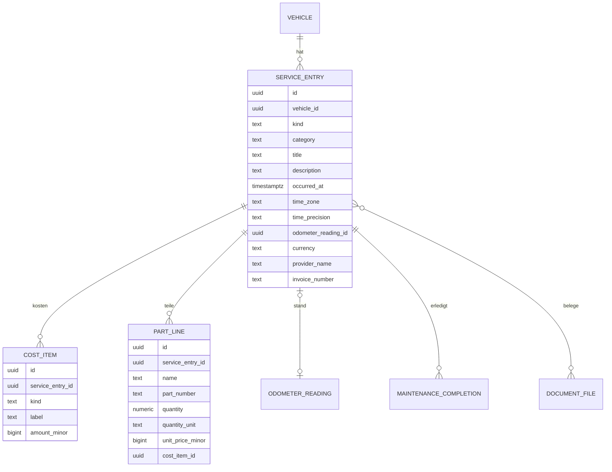

# 10 – Domänenmodell ServiceHistory (Wartung, Reparatur, Nachrüstung)

- **Status:** Entwurf (AP-3) · **Datum:** 2026-09-30
- **Grundlagen:** ADR-009, ADR-011, ADR-012, ADR-029

## 1. Zweck und Abgrenzung

ServiceHistory dokumentiert **durchgeführte** Arbeiten am Fahrzeug: planmäßige Wartung, Reparatur und Nachrüstung. Werkstattbesuche mit mehreren Arbeiten werden als ein Eintrag mit mehreren Positionen erfasst. Die Einträge enthalten Kostenpositionen, getrennt nach Teilen, Arbeit und Sonstigem, sowie optional eine Teileliste.

**Was fällig ist**, entscheidet Maintenance. Ein Serviceeintrag kann eine oder mehrere Wartungsdefinitionen **erledigen**; die Verknüpfung wird gespeichert (§5, SH-04).

Nicht im MVP: Teilelager mit Bestandsabbuchung, Planer/Kanban, Inspektions-**Checklisten** mit Prüfpunkten (E-5). Eine Inspektion als Eintragsart ist dagegen enthalten.

## 2. Datenmodell

| Feld | Regel |
|---|---|
| `kind` | `maintenance` (planmäßige Wartung), `inspection` (Inspektion/Durchsicht, auch HU/TÜV-Termin), `repair` (Reparatur), `upgrade` (Nachrüstung/Umbau) |
| `category` | frei konfigurierbare Kategorie je Konto (z. B. Bremsen, Reifen, Elektrik); optional |
| `title` | Pflicht, 1–200 Zeichen |
| `currency` | eine Währung je Eintrag, gilt für alle Kostenpositionen (ADR-029) |
| `provider_name` | Werkstatt oder „Eigenleistung“ |
| `invoice_number` | optional, für Belegsuche |
| `cost_unknown` | `true`, wenn die Kosten nicht bekannt sind (I-SH-1) |
| `cost_item.kind` | `parts`, `labor`, `other` |
| `cost_item.amount_minor` | ≥ 0; Gutschriften als eigene Position `other` mit negativem Betrag sind erlaubt, die Summe des Eintrags bleibt aber ≥ 0 |
| `part_line` | informativ; über `cost_item_id` kann eine Teileliste einer Position `parts` zugeordnet werden |

## 3. Invarianten

- **I-SH-1:** Ein Eintrag hat entweder mindestens **eine** Kostenposition (auch mit Betrag 0, z. B. Garantiearbeit) oder das Kennzeichen `cost_unknown = true` und dann keine Positionen. So sind „kostenlos“ und „Kosten unbekannt“ unterscheidbar.
- **I-SH-2:** `Σ part_line.quantity × unit_price` einer zugeordneten Position muss **nicht** gleich dem Positionsbetrag sein (Rabatte, Pauschalen). Weicht sie ab, zeigt die UI den Unterschied als Hinweis.
- **I-SH-3:** Messpunkt wie bei Fuel: Der Eintrag besitzt seinen Messpunkt (`source = service`), Änderungen laufen als Korrektur (I-ODO-3/4). Der Stand ist Pflicht nur bei `odometer_required`.
- **I-SH-4:** Das Ändern von `kind` ist eine normale Feldänderung mit Audit. Es entsteht kein neuer Eintrag, IDs, Anhänge und Verknüpfungen bleiben erhalten.

## 4. Operationen

| Operation | Beschreibung | Rolle |
|---|---|---|
| `RecordServiceEntry` | inkl. Positionen, Teilen, Messpunkt, Erledigungen (SH-04) in **einer** Transaktion | Bearbeiter |
| `UpdateServiceEntry` | If-Match; Positionen werden als Ganzes ersetzt | Bearbeiter |
| `DeleteServiceEntry` | Soft-Delete inkl. Messpunkt; Erledigungen werden entfernt, Fälligkeiten werden neu berechnet | Bearbeiter |
| `ListServiceEntries` | Filter: Art, Zeitraum, Schlagwort, Werkstatt, Volltext in Titel/Beschreibung/Teilen | Leser |
| `ServiceSummary(zeitraum)` | Summen je Art und je Kostenart, je Währung | Leser |

## 5. Regeln

### SH-01 – Summe eines Eintrags
`total = Σ cost_item.amount_minor`, zusätzlich je `kind` (Teile/Arbeit/Sonstiges) ausgewiesen.

### SH-02 – Zusammenfassung
Summen je Eintragsart und je Kostenart im Zeitraum (nach `occurred_at` in der Zeitzone des Eintrags), getrennt je Währung. Einträge mit `cost_unknown` werden gezählt, aber als „ohne Kosten“ ausgewiesen.

### SH-03 – Plausibilität
- Zeitpunkt in der Zukunft → Ablehnung (wie ODO-02). **Geplante** Arbeiten gehören zu Maintenance.
- Messpunkt: Befunde aus ODO-03 in derselben `422`-Antwort.
- Summe des Eintrags < 0 → Ablehnung.

### SH-04 – Erledigung von Wartungsdefinitionen
Beim Anlegen oder Ändern kann der Nutzer Wartungsdefinitionen desselben Fahrzeugs als **erledigt** markieren. Gespeichert wird je Definition ein `maintenance_completion` (Tabelle im Modul Maintenance, angelegt über dessen Service) mit `service_entry_id`, Zeitpunkt und Stand des Eintrags.
- Die Erledigung ist **idempotent**: Je Paar (Definition, Serviceeintrag) gibt es höchstens eine Erledigung. Erneutes Speichern schreibt sie nicht fort, sondern aktualisiert Zeitpunkt und Stand.
- Ändert sich Zeitpunkt oder Stand des Serviceeintrags, übernimmt die Erledigung die neuen Werte, und Maintenance berechnet die Fälligkeit neu.
- Wird der Serviceeintrag gelöscht, wird auch die Erledigung gelöscht, und die Fälligkeit richtet sich wieder nach der vorherigen Erledigung.
- Alles läuft in der Transaktion des Serviceeintrags. Scheitert das Speichern, gibt es auch keine Erledigung.

## 6. Domain-Events

| Event | Abnehmer |
|---|---|
| `service.entry_recorded` / `service.entry_updated` / `service.entry_deleted` (mit Summen je Kostenart) | Costs (Kostenbuch) |
| `maintenance.completion_changed` (von Maintenance ausgelöst) | Notifications (Stufe zurücksetzen) |

## 7. Soll-Beispiele

| # | Aktion | Erwartung |
|---|---|---|
| S-1 | Inspektion am 10.03.2026 bei 45 000 km; Teile 180,00 €, Arbeit 240,00 €, Entsorgung 12,50 € (other) | Summe 432,50 €; Teile 180,00; Arbeit 240,00; Sonstiges 12,50 |
| S-2 | S-1 erledigt „Ölwechsel“ und „Innenraumfilter“ | zwei Erledigungen; beide Fälligkeiten ab 10.03.2026 / 45 000 km (Maintenance) |
| S-3 | S-1 wird zweimal gespeichert (Wiederholung nach Netzfehler, gleicher Idempotency-Key) | eine Erledigung je Definition, keine doppelte Fortschreibung |
| S-4 | Datum von S-1 wird auf 12.03.2026 korrigiert | Erledigungen übernehmen 12.03.2026; Fälligkeit verschiebt sich entsprechend |
| S-5 | S-1 wird gelöscht | Erledigungen entfernt; Fälligkeit wieder aus vorheriger Erledigung; Messpunkt gelöscht |
| S-6 | Art von „Reparatur“ auf „Wartung“ geändert | gleicher Eintrag, Audit „kind: repair → maintenance“ |
| S-7 | Garantiereparatur mit Position Arbeit 0,00 € | gespeichert; zählt in Auswertungen als Eintrag mit Kosten 0 |

## 8. Abgleich mit Phase 1 (vorläufig)

| Phase 1 | Verhalten LubeLogger (Kurzform) | Vectra | Klasse |
|---|---|---|---|
| BR-033 | Erledigung schreibt Reminder vor dem Speichern fort, ohne Verknüpfung, bei jeder Bearbeitung erneut | SH-04: gespeicherte, idempotente Erledigung | FIX |
| BR-036 (Teil) | ein Gesamtbetrag je Eintrag | Kostenpositionen Teile/Arbeit/Sonstiges | FIX |
| BR-042/BR-043 | Abbuchung und Rückbuchung aus dem Teilelager | Teilelager nicht im MVP (E-5) | DROP |
| BR-044/BR-045 | Planer erzeugt Serviceeinträge | Planer nicht im MVP | DROP |
| BR-046/BR-047 | Inspektions-Checklisten erzeugen Service-Kopien | Checklisten nicht im MVP; Inspektion ist Eintragsart `inspection`, keine Kopien | DROP |
| BR-057 | Typwechsel über Kopieren und Löschen, ohne Transaktion | I-SH-4 Feldänderung | FIX |
| BR-058 | Verweise auf andere Einträge als Anhang | Verknüpfungen zu Dokumenten (AP-4) | offen (AP-4) |

## 9. Offene Punkte

- **OP-SH-1:** Werkstätten als eigene Entität (Adresse, wiederverwendbar) statt Freitext? Vorschlag: Freitext im MVP, Vorschlagsliste aus bisherigen Einträgen.
- **OP-SH-2:** Mehrwertsteuer getrennt ausweisen? Vorschlag: nicht im MVP; Beträge sind Bruttobeträge.
