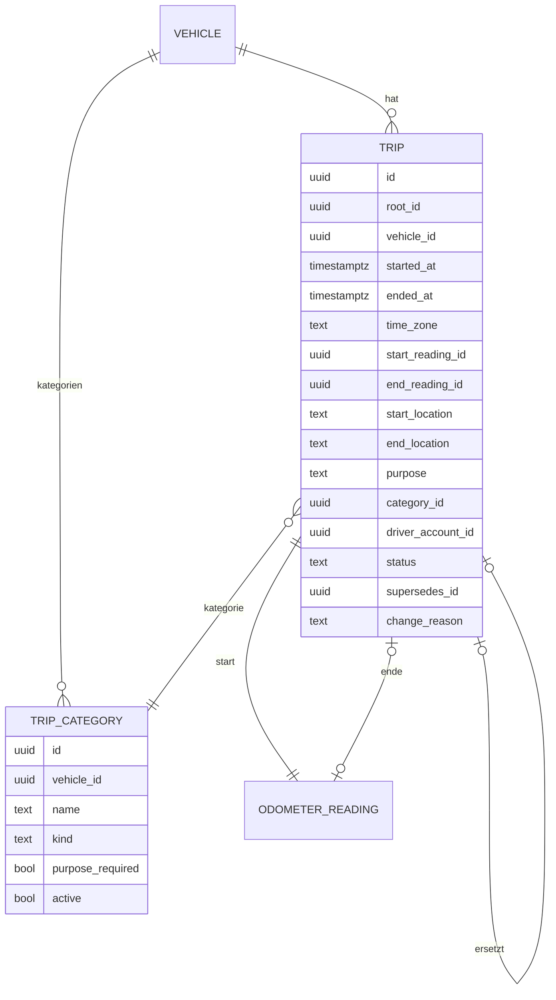

# 10 – Domänenmodell Trips (Fahrten)

- **Status:** Entwurf (AP-4) · **Datum:** 2026-09-30
- **Grundlagen:** Auftrag 6.8; offene Frage Q-13; ADR-009, ADR-010, ADR-011
- **Neu gegenüber LubeLogger:** Dafür gibt es kein Vorbild in der Altanwendung.

## 1. Zweck und Abgrenzung

Trips erfasst einzelne Fahrten mit Start- und Endzeit, Start- und Endstand, optional Orten, Zweck und Kategorie. Die gefahrene Strecke wird **berechnet**, nicht eingegeben.

Ein steuerlich anerkanntes Fahrtenbuch ist **kein** MVP-Ziel (Auftrag 6.8). Das Modell wird aber so angelegt, dass abgeschlossene Fahrten **nicht überschrieben** werden: Änderungen sind Korrekturen mit Historie (Entscheidung zu Q-13). Das macht einen späteren Ausbau möglich, ist aber keine Zusage steuerlicher Anerkennung.

## 2. Datenmodell

| Feld | Regel |
|---|---|
| `root_id` | ID der ersten Fassung. Alle Korrekturen teilen sie, und die Messpunkte verweisen darauf (`source_ref`). |
| `started_at`, `ended_at` | immer mit Uhrzeit (`time_precision = exact`); `ended_at` leer bei laufender Fahrt |
| `start_location`, `end_location` | Freitext, optional. Koordinaten sind nicht im MVP (Datenschutz). |
| `purpose` | Freitext; Pflicht, wenn die Kategorie `purpose_required` hat |
| `driver_account_id` | wer gefahren ist; Default: erfassendes Konto; nur Mitglieder des Fahrzeugs |
| `status` | `open` (läuft), `closed`, `superseded` (durch Korrektur ersetzt), `cancelled` (storniert) |
| `change_reason` | Pflicht bei Korrektur und Storno |
| `trip_category.kind` | `private`, `business`, `commute`, `other`; Auswertungen gruppieren danach |

Standardkategorien je neuem Fahrzeug: Privat (`private`), Geschäftlich (`business`, Zweck Pflicht), Arbeitsweg (`commute`), Sonstige (`other`). Namen und Pflichtangaben sind je Fahrzeug änderbar (Auftrag 6.8: konfigurierbar).

## 3. Invarianten

- **I-TR-1:** Gültige Fahrten (`open`, `closed`) eines Fahrzeugs **überlappen nicht**: Die Intervalle `[started_at, ended_at)` sind disjunkt. Eine laufende Fahrt gilt als `[started_at, ∞)`. Daraus folgt: höchstens eine laufende Fahrt je Fahrzeug.
- **I-TR-2:** `ended_at > started_at`.
- **I-TR-3:** Gesamtlaufleistung am Ende ≥ Gesamtlaufleistung am Start. Das ist eine harte Regel, nicht bestätigbar.
- **I-TR-4:** Eine Fahrt mit Status `closed` wird nie geändert. Jede Änderung erzeugt eine neue Fassung (TR-03).
- **I-TR-5:** Start- und End-Messpunkt gehören der Fahrt (`source = trip_start`/`trip_end`, `source_ref = root_id`).

## 4. Operationen

| Operation | Beschreibung | Rolle |
|---|---|---|
| `StartTrip` | laufende Fahrt mit Startzeit und Startstand (Android: „Fahrt starten“) | Bearbeiter |
| `FinishTrip` | laufende Fahrt abschließen (Endzeit, Endstand) | Bearbeiter |
| `RecordTrip` | abgeschlossene Fahrt nachträglich erfassen | Bearbeiter |
| `EditOpenTrip` | laufende Fahrt ändern (noch keine Korrektur) | Bearbeiter |
| `CorrectTrip` | neue Fassung einer abgeschlossenen Fahrt mit Begründung | Bearbeiter |
| `CancelTrip` | stornieren mit Begründung; Messpunkte werden gelöscht | Bearbeiter |
| `ListTrips` | Standard: nur gültige Fassungen; optional mit Historie | Leser |
| `TripReport(zeitraum)` | TR-05 | Leser |
| `ManageCategories` | Kategorien je Fahrzeug | Bearbeiter |

## 5. Regeln

### TR-01 – Gefahrene Strecke
`distance = total(end_reading) − total(start_reading)` (ODO, abschnittsübergreifend). Das Feld ist nicht eingebbar. Die Anzeige erfolgt in der Anzeigeeinheit. 0 ist erlaubt (z. B. Rangierfahrt).

### TR-02 – Validierung beim Speichern
1. I-TR-2 und I-TR-3 → sonst `422`, nicht bestätigbar.
2. I-TR-1 gegen alle anderen gültigen Fahrten → bei Überlappung `422` mit der kollidierenden Fahrt, nicht bestätigbar (Auftrag 6.8).
3. Beide Messpunkte durchlaufen ODO-03. Befunde (z. B. Sprung P3, weil die Fahrt 600 km in 1 h behauptet) sind bestätigbar, weil die Messpunkte selbst falsch sein könnten. Sie erscheinen in derselben Antwort.
4. Kategorie mit `purpose_required` und leerer Zweck → `422`.

### TR-03 – Korrektur und Storno
- `CorrectTrip` legt eine neue Fahrt mit gleicher `root_id` und `supersedes_id` = alte Fassung an. Die alte erhält `superseded`. Die Messpunkte werden über ODO-Korrekturen angepasst (I-ODO-4). Alles läuft in einer Transaktion.
- `CancelTrip` setzt `cancelled`. Die Fahrt bleibt mit Begründung in der Historie sichtbar, ihre Messpunkte werden gelöscht.
- Die Historie zeigt alle Fassungen einer `root_id` mit Zeitpunkt, Akteur und Begründung (ADR-011).

### TR-04 – Lücken zwischen Fahrten
Für aufeinanderfolgende gültige Fahrten *f₁*, *f₂* gilt `Lücke = total(f₂.start) − total(f₁.ende)`. Eine Lücke > 0 bedeutet nicht erfasste Strecke und wird als **Hinweis** angezeigt und in TR-05 als „nicht zugeordnet“ ausgewiesen. Sie ist kein Fehler.

### TR-05 – Auswertung
Je Zeitraum (Fahrten, deren `started_at` im Zeitraum liegt):
- Strecke und Anzahl je Kategorie-Art und je Kategorie, Anteil in % an der Summe aller Fahrten.
- „Nicht zugeordnet“ = `DistanceBetween(von, bis)` (ODO-05) − Summe der Fahrtstrecken. Das kann durch Fahrten, die über die Zeitraumgrenze reichen, leicht abweichen; der Hinweis erklärt das.
- Je Fahrer (bei mehreren Mitgliedern).
- Export als CSV nach MVP-Umfang des Moduls Import/Export (AP-7).

### TR-06 – Assistent
Der Assistent kann aus natürlicher Sprache einen **Vorschlag** für `RecordTrip` erstellen („Gestern 8 bis 9 Uhr zum Kunden Müller, 42 km“). Wird nur die Strecke genannt, schlägt er den Endstand = letzter bekannter Stand + Strecke vor und zeigt das deutlich. Gespeichert wird erst nach Bestätigung (Auftrag 6.13, AP-10).

## 6. Domain-Events

| Event | Abnehmer |
|---|---|
| `trip.started` / `trip.finished` / `trip.corrected` / `trip.cancelled` | Maintenance (über `odometer.*` indirekt), Dashboard |

## 7. Soll-Beispiele

| # | Situation | Erwartung |
|---|---|---|
| T-1 | Start 08:00 bei 12 000 km, Ende 08:45 bei 12 038 km | Strecke 38 km |
| T-2 | Fahrt 08:00–09:00 existiert; neue Fahrt 08:30–10:00 | `422` Überlappung, nicht bestätigbar |
| T-3 | Fahrt 08:00–09:00 und neue Fahrt 09:00–10:00 | erlaubt (halboffenes Intervall) |
| T-4 | laufende Fahrt seit 07:00; neue Fahrt 12:00–13:00 nachtragen | `422` (laufende Fahrt reicht bis ∞) |
| T-5 | Endstand 11 990 km bei Startstand 12 000 km | `422` (I-TR-3) |
| T-6 | Endstand nachträglich von 12 038 auf 12 083 km korrigiert, Begründung „Tippfehler“ | neue Fassung, alte `superseded`; Strecke 83 km; Historie zeigt beide |
| T-7 | Kategorie Geschäftlich ohne Zweck | `422` |
| T-8 | Fahrt A endet bei 12 038 km, nächste Fahrt B beginnt bei 12 100 km | Hinweis „62 km nicht erfasst“ |
| T-9 | Stornierte Fahrt | nicht in Summen; mit Begründung in der Historie |

## 8. Offene Punkte

- **OP-TR-1 (Q-13):** Steuerlich anerkanntes Fahrtenbuch als späteres Ziel? Dafür wären unter anderem zeitnahe Erfassung, lückenlose Nummerierung, Unveränderbarkeit mit Prüfnachweis und Pflichtangaben für geschäftliche Fahrten nötig. Das ist eine Entscheidung nach MVP.
- **OP-TR-2:** Automatische Fahrterkennung (GPS/Bluetooth in der Android-App) → nach MVP, Datenschutzkonzept nötig.
