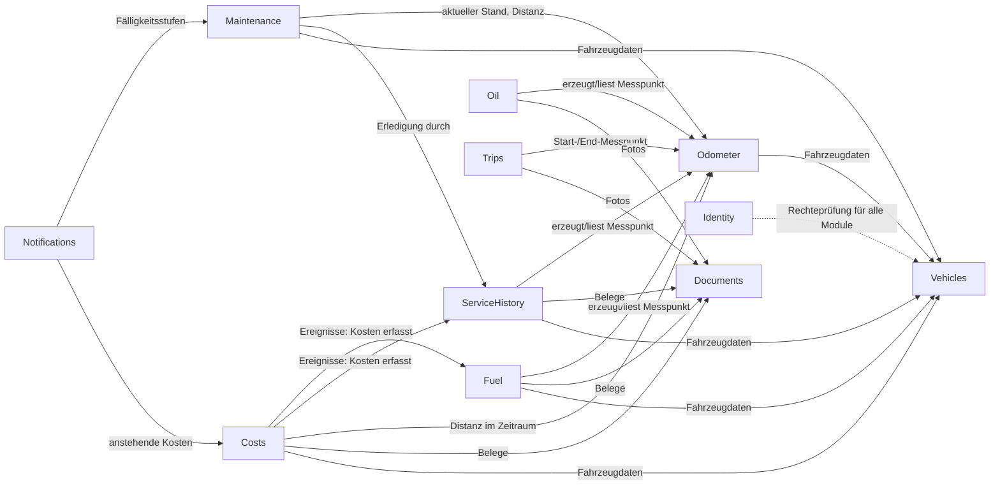

# 10 – Domänenmodelle: Übersicht und gemeinsame Bausteine

- **Status:** Entwurf (AP-3, ergänzt in AP-4) · **Datum:** 2026-09-30
- **Leitlinie:** ADR-000. Die Modelle sind eigenständig formuliert. Bezüge auf Phase 1 (BR-xxx, D-xx) nennen nur, welches fachliche Verhalten betrachtet wurde, und klassifizieren es vorläufig nach ADR-031 (KEEP/FIX/DROP). Verbindlich klassifiziert wird im Soll-Regelkatalog (AP-5).

## 1. Dokumente dieses Arbeitspakets

| Datei | Modul | Kern |
|---|---|---|
| `10-domaene-odometer.md` | Odometer | Messpunkte, Zählerabschnitte, Stand zu einem Zeitpunkt, Distanz |
| `10-domaene-fuel.md` | Fuel | Tank- und Ladevorgänge, Verbrauchsintervalle, Durchschnitt |
| `10-domaene-servicehistory.md` | ServiceHistory | Wartung, Reparatur, Nachrüstung mit Kostenpositionen und Teilen |
| `10-domaene-maintenance.md` | Maintenance | Wartungsdefinitionen, Fälligkeit, Erledigung |
| `10-domaene-costs.md` | Costs | Sonstige Kosten, wiederkehrende Kosten, Kostenbuch, Kennzahlen |
| `10-domaene-vehicles.md` | Vehicles (AP-4) | Stammdaten, Lebenszyklus, Bilder, Zusatzfelder, Dashboard |
| `10-domaene-identity.md` | Identity (AP-4) | Konten, Anmeldung, Sitzungen, API-Tokens, Einladungen, Rollen |
| `10-domaene-oil.md` | Oil (AP-4) | Ölstand, Nachfüllung, Ölwechsel, Nachfüllrate, Verbrauch |
| `10-domaene-trips.md` | Trips (AP-4) | Fahrten, Überlappungsschutz, Korrekturfassungen, Kategorien |
| `10-domaene-documents.md` | Documents (AP-4) | Dateien, Fahrzeugakte, Verknüpfungen, Suche |
| `10-domaene-notes.md` | Notes (AP-4) | Notizen, Aufnahme zurückgestellter Altdaten |

Die Fahrzeugattribute, die die Fachmodule brauchen, sind in §5 gesammelt und in `10-domaene-vehicles.md` umgesetzt.

## 2. Kontextkarte

Pfeilrichtung = „hängt ab von“. **Odometer hängt von keinem anderen Fachmodul ab** (nur von Vehicles). Zyklen sind verboten (ADR-001). Costs erhält Kosten aus Fuel und ServiceHistory ausschließlich über Domain-Events, die im selben Prozess und in derselben Transaktion verarbeitet werden (ADR-004).

## 3. Gemeinsame Wertobjekte

Die Wertobjekte liegen in einem gemeinsamen Paket ohne Fachlogik (`shared/kernel`). Alle Module verwenden sie gleich.

### 3.1 `EventTime` (ADR-008)
| Feld | Typ | Regel |
|---|---|---|
| `occurred_at` | `timestamptz` | UTC, Ordnungskriterium |
| `time_zone` | IANA-Name | Pflicht |
| `time_precision` | `exact` \| `date_only` | bei `date_only` ist `occurred_at` = 12:00 lokal |

**Ordnung zweier Ereignisse:** zuerst nach `occurred_at`, dann nach `recorded_at` (Serverzeit der Erfassung), zuletzt nach `id`. Die Ordnung ist damit immer eindeutig und stabil.

### 3.2 `Quantity` (ADR-007)
| Feld | Typ | Regel |
|---|---|---|
| `value` | `bigint` | kanonisch: `m`, `s`, `ml`, `Wh` |
| `input_value` | `numeric(14,4)` | wie eingegeben |
| `input_unit` | Code | `km`, `mi`, `h`, `l`, `gal_us`, `gal_imp`, `kWh` |

Umrechnung beim Speichern: `value = round_half_even(input_value × Faktor)`. Faktoren: km = 1 000 m; mi = 1 609,344 m; h = 3 600 s; l = 1 000 ml; gal_us = 3 785,411784 ml; gal_imp = 4 546,09 ml; kWh = 1 000 Wh.

### 3.3 `Money` (ADR-029)
`amount_minor` (`bigint`) + `currency` (ISO 4217). Rechenregeln:
- Summen nur innerhalb **einer** Währung. Ergebnisse über mehrere Währungen sind eine Liste je Währung.
- Die kleinste Einheit richtet sich nach ISO 4217 (EUR 2 Stellen, JPY 0 Stellen).
- Rundung auf die kleinste Einheit kaufmännisch (half-up), und nur dort, wo aus Preis × Menge ein Betrag entsteht.

### 3.4 `Ratio` (berechnete Kennzahlen)
Verbrauch, Kosten pro Distanz und Ähnliches werden **nie gespeichert**. Die Berechnung läuft als exakte Dezimalrechnung (`numeric` in SQL bzw. Dezimaltyp in Go, kein `float64`) auf kanonischen Werten. Gerundet wird nur bei der Ausgabe (ADR-007).

## 4. Gemeinsame Konventionen aller Fachentitäten

| Feld | Bedeutung |
|---|---|
| `id` | UUIDv7 (ADR-006) |
| `vehicle_id` | nach dem Anlegen unveränderlich (ADR-016) |
| `version` | optimistisches Locking (ADR-012) |
| `created_at`, `created_by`, `updated_at`, `updated_by` | vom Server gesetzt |
| `recorded_at` | Serverzeit der Ersterfassung (bei Offline-Erfassung: Eingang am Server) |
| `origin` | `web`, `android`, `api`, `import:lubelogger`, `import:csv`, `assistant`, `system` |
| `deleted_at` | Soft-Delete (ADR-004, ADR-011) |
| `note` | Freitext, max. 10 000 Zeichen |
| `tags` | bis 20 Schlagwörter je Eintrag |

**Rechte:** Die Rollenmatrix aus ADR-016 gilt für alle Operationen dieser Module. Die Module definieren keine eigenen Rollen.

## 5. Anforderungen an Vehicles

Die Fachkern-Module benötigen folgende Fahrzeugattribute:

| Attribut | Benötigt von | Bedeutung |
|---|---|---|
| `usage_meter` ∈ {`distance`, `engine_hours`} | Odometer, Fuel, Maintenance, Costs | Welche Größe der Zähler misst |
| `energy_carriers[]` ⊆ {`petrol`, `diesel`, `lpg`, `electricity`} | Fuel | Zulässige Energieträger; zwei Einträge = bivalent/Plug-in-Hybrid |
| `tank_capacity_ml` (optional, je Energieträger) | Fuel (Plausibilität) | Tankinhalt |
| `battery_usable_capacity_wh` (optional) | Fuel (EV-Verbrauch) | nutzbare Batteriekapazität |
| `oil_dipstick_range_ml`, `oil_capacity_ml` (optional) | Oil | Ölmenge Min→Max am Peilstab; Füllmenge |
| `odometer_required` (Default `true`) | Fuel, ServiceHistory | ob ein Kilometerstand bei Einträgen Pflicht ist |
| `owner_time_zone` | Maintenance | Zeitzone für Fälligkeiten nach Kalenderdatum |
| `default_currency` | Fuel, ServiceHistory, Costs | Vorbelegung |
| `purchase` (Datum, Preis), `sale` (Datum, Preis) | Costs | Besitzzeitraum, Wertverlust |
| `display_units` | alle | Vorbelegung der Anzeigeeinheiten (ADR-007) |

CNG und Wasserstoff (Abrechnung in kg) sind nicht im MVP. Sie brauchen eine Masseeinheit in ADR-007; siehe offene Punkte in `10-domaene-fuel.md`.

## 6. Präzisierungen bestehender ADRs

Beim Ausarbeiten der Modelle wurden zwei Punkte aus ADR-009 präzisiert. Die Nachträge stehen direkt in ADR-009 (Abschnitt „Präzisierung AP-3“):
1. Der Messwert heißt allgemein `value` (kanonisch `m` oder `s` je `usage_meter`). `value_m` war ein Beispiel für Distanz.
2. Der „Stand zu einem Zeitpunkt“ wird zwischen den umgebenden gültigen Messpunkten **linear interpoliert** und nicht vom zeitlich nächsten Messpunkt übernommen. Nur so lassen sich Monatsdistanzen sauber schneiden (Details `10-domaene-odometer.md`, ODO-06).
