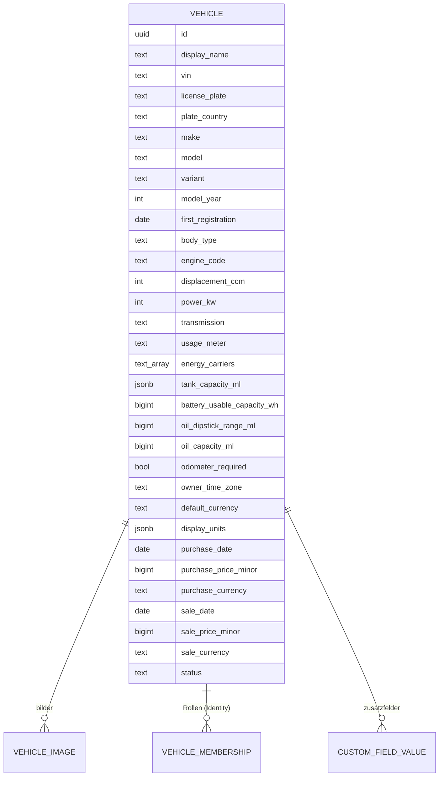

# 10 – Domänenmodell Vehicles (Fahrzeuge)

- **Status:** Entwurf (AP-4) · **Datum:** 2026-09-30
- **Grundlagen:** Auftrag 6.3; ADR-007, ADR-016, ADR-017; Anforderungen aus `10-domaene-uebersicht.md` §5

## 1. Zweck und Abgrenzung

Vehicles verwaltet Stammdaten, Lebenszyklus und Fahrzeugbilder. Das Fahrzeug ist der zentrale Kontext der Anwendung (Auftrag 6.15). Alle Fachmodule verweisen auf `vehicle_id`.

Wer ein Fahrzeug sehen oder ändern darf, regelt Identity (Mitgliedschaften, ADR-016). Vehicles speichert keine Rechte.

## 2. Datenmodell

### 2.1 Stammdaten (Auftrag 6.3)
| Feld | Regel |
|---|---|
| `display_name` | Pflicht, 1–80 Zeichen, frei wählbar („Familienkombi“). Vorbelegung: Hersteller + Modell |
| `vin` | optional, siehe VE-01 |
| `license_plate`, `plate_country` | optional; Land als ISO 3166-1 alpha-2 |
| `make`, `model`, `variant` | Freitext; Vorschlagsliste aus bisherigen Einträgen der Installation |
| `model_year`, `first_registration` | Baujahr bzw. Erstzulassung |
| `body_type` | `car`, `motorcycle`, `van`, `truck`, `camper`, `trailer`, `tractor`, `boat`, `other` |
| Motorisierung | `engine_code`, `displacement_ccm`, `power_kw`, `transmission` (`manual`, `automatic`, `other`) |
| `energy_carriers` | ⊆ {`petrol`, `diesel`, `lpg`, `electricity`}; leer bei Anhänger/Fahrzeug ohne Antrieb |

### 2.2 Betriebsattribute (für die Fachmodule)
| Feld | Default | Benutzt von |
|---|---|---|
| `usage_meter` | `distance`; `engine_hours` für Traktoren, Boote, Maschinen | Odometer, Maintenance |
| `tank_capacity_ml` | leer; JSON je Energieträger, z. B. `{"petrol": 50000, "lpg": 60000}` | Fuel (FU-08) |
| `battery_usable_capacity_wh` | leer | Fuel (FU-05) |
| `oil_dipstick_range_ml` | leer; Ölmenge zwischen Min- und Max-Markierung | Oil (OI-02) |
| `oil_capacity_ml` | leer; Füllmenge beim Ölwechsel | Oil (OI-05) |
| `odometer_required` | `true` | Fuel, ServiceHistory, Oil |
| `owner_time_zone` | Zeitzone des anlegenden Nutzers | Maintenance, Costs |
| `default_currency` | Währung des anlegenden Nutzers | Fuel, ServiceHistory, Costs |
| `display_units` | abgeleitet aus Nutzereinstellung | alle Ausgaben (ADR-007) |

### 2.3 Lebenszyklus
`status` ∈ {`active`, `sold`, `archived`}.
- `sold`: Verkaufsdatum ist Pflicht. Das Fahrzeug bleibt lesbar und in Auswertungen enthalten. Neue Einträge sind nur mit Datum ≤ Verkaufsdatum möglich (Nacherfassung). Wiederkehrende Kosten und Wartungen werden nicht mehr gemeldet.
- `archived`: aus Listen ausgeblendet, sonst wie `sold`, aber ohne Verkaufsdaten (z. B. abgemeldet, verschrottet).
- Wechsel zurück auf `active` ist möglich und wird auditiert.

### 2.4 Bilder
`vehicle_image` verknüpft Dateien (ADR-017) mit dem Fahrzeug; genau ein Bild kann `primary` sein. Bilder werden wie andere Dateien nur nach Rechteprüfung ausgeliefert.

### 2.5 Zusatzfelder
Eigene Felder je Konto (Definition: Name, Typ `text`/`number`/`date`/`bool`, Pflicht ja/nein) für Fahrzeuge. Werte werden je Fahrzeug gespeichert. Wird eine Felddefinition entfernt, bleiben vorhandene Werte **erhalten** und werden als „verwaiste Zusatzfelder“ angezeigt, bis der Nutzer sie löscht. Zusatzfelder für andere Eintragsarten sind nicht im MVP. Importierte Zusatzfelder anderer Eintragsarten landen in der Notiz des Eintrags (AP-7).

## 3. Invarianten

- **I-VE-1:** Jedes Fahrzeug hat mindestens einen Eigentümer (ADR-016; geprüft von Identity).
- **I-VE-2:** `energy_carriers` darf nur verkleinert werden, wenn keine Tankvorgänge des entfernten Energieträgers existieren. Sonst `409` mit Anzahl der betroffenen Einträge.
- **I-VE-3:** `usage_meter` ist unveränderlich, sobald Messpunkte existieren.
- **I-VE-4:** `sale_date ≥ purchase_date`, falls beide gesetzt.
- **I-VE-5:** Die Kraftstoff- bzw. Antriebsart wird ausschließlich aus `energy_carriers` abgeleitet. Es gibt keine zusätzlichen Kennzeichen wie „ist Diesel“ oder „ist elektrisch“, die davon abweichen könnten.

## 4. Operationen

| Operation | Beschreibung | Rolle |
|---|---|---|
| `CreateVehicle` | anlegen; der anlegende Nutzer wird Eigentümer (Identity) | jedes aktive Konto |
| `UpdateVehicle` | Stammdaten ändern (If-Match) | Bearbeiter |
| `MarkSold` / `Archive` / `Reactivate` | Lebenszyklus | Eigentümer |
| `DeleteVehicle` | Soft-Delete **mit allen Einträgen**; Wiederherstellung innerhalb der Frist (ADR-011) | Eigentümer |
| `TransferOwnership` | über Identity (Einladung mit Annahme) | Eigentümer |
| `AddImage` / `RemoveImage` / `SetPrimaryImage` | Bilder | Bearbeiter |
| `ListVehicles` | alle Fahrzeuge mit Mitgliedschaft; Filter Status | Leser |
| `VehicleDashboard` | Kennzahlen aus den Fachmodulen (Auftrag 6.15), aggregiert über deren Services | Leser |

## 5. Regeln

### VE-01 – FIN/VIN
- Normalisierung: Großbuchstaben, Leerzeichen und Bindestriche entfernt.
- 17 Zeichen aus `A–Z` ohne `I`, `O`, `Q` und Ziffern → gültig.
- Die Prüfziffer (Stelle 9) wird nur geprüft, wenn das Fahrzeug laut Nutzer für Nordamerika gebaut wurde. Ein Fehler ist dann eine **bestätigbare Warnung**, keine Ablehnung.
- Andere Längen (Fahrzeuge vor 1981, Anhänger) → Warnung „nicht normgerecht“, speicherbar.
- Dieselbe FIN bei einem anderen Fahrzeug, **auf das der Nutzer Zugriff hat**, → Warnung „möglicherweise doppelt angelegt“. Über fremde Fahrzeuge wird nichts verraten.

### VE-02 – Anzeige-Kennung
Listen zeigen `display_name` und darunter das Kennzeichen, falls vorhanden, sonst die letzten 6 Stellen der FIN. Welche Kennung angezeigt wird, lässt sich in der Nutzereinstellung umstellen (Kennzeichen, FIN oder ein Zusatzfeld).

### VE-03 – Dashboard
Das Dashboard enthält (Auftrag 6.15): aktueller Stand (ODO-04), gefahrene Strecke im gewählten Zeitraum (ODO-05), Verbrauch (FU-04), Ölverbrauch und letzte Nachfüllung (Oil), nächste und überfällige Wartungen (MA-07), Kosten im Zeitraum (CO-03), letzte Serviceeinträge und Dokumentenhinweise (z. B. HU-Bericht fehlt). Vehicles berechnet nichts selbst, sondern ruft die Services der Module auf.

## 6. Soll-Beispiele

| # | Aktion | Erwartung |
|---|---|---|
| V-1 | FIN `wvw zzz 1k z 6w 123456` | gespeichert als `WVWZZZ1KZ6W123456` |
| V-2 | FIN mit `O` an Stelle 5 | `422` (unzulässiges Zeichen), nicht bestätigbar |
| V-3 | FIN mit 13 Zeichen (Oldtimer) | Warnung, nach Bestätigung gespeichert |
| V-4 | Energieträger `lpg` entfernen, 12 LPG-Tankvorgänge vorhanden | `409` mit „12 Tankvorgänge betroffen“ |
| V-5 | Diesel → Elektro umstellen (ohne Dieseleinträge) | `energy_carriers = [electricity]`; kein widersprüchliches Kennzeichen bleibt zurück |
| V-6 | Fahrzeug verkauft am 01.06.2026, neuer Tankvorgang am 10.06.2026 | `422` „nach Verkaufsdatum“ |
| V-7 | Bearbeiter versucht `DeleteVehicle` | `403` |

## 7. Abgleich mit Phase 1 (vorläufig)

| Phase 1 | Verhalten LubeLogger (Kurzform) | Vectra | Klasse |
|---|---|---|---|
| BR-049 | Zusatzfeld-Werte gehen verloren, wenn die Vorlage geleert wird | §2.5 Werte bleiben erhalten | FIX |
| BR-050 | Kennung aus Kennzeichen oder Zusatzfeld | VE-02 | KEEP |
| D-05 | Server-Defaults für Einheiten springen beim Aktivieren der Anmeldung | Einheiten sind Nutzer-/Fahrzeugeinstellung (ADR-007) | FIX |
| D-19 | Kraftstoffart-Kennzeichen werden per API nicht zurückgesetzt | I-VE-5 | FIX |

## 8. Offene Punkte

- **OP-VE-1:** Fahrzeugdaten per FIN-Decoder vorbelegen (externer Dienst) → nach MVP, Datenschutzhinweis nötig.
- **OP-VE-2:** Zusatzfelder für weitere Eintragsarten → nach MVP.
